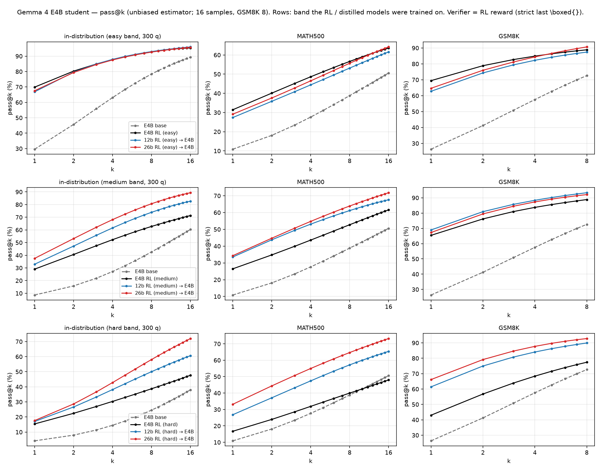

# Gemma 4 RL → Off-Policy Distillation Experiments

Distill the **RL'd** Gemma 4 policies into **base** (pretrained) Gemma 4 models, per
DeepScaleR difficulty band, using **off-policy top-128 forward-KL**. The teacher traces are
the same top-128 trace format already collected by
`scale_train/run_gemma4_bestckpt_trace_collection.sh`.

- **Models (4):** e2b, e4b, 12b, 26b-a4b (RL'd from `google/gemma-4-{E2B,E4B,12B,26B-A4B}`).
- **Datasets (3):** DeepScaleR difficulty bands **easy / medium / hard**
  (`JWei05/DeepScaleR-Easy-Medium-Hard-Gemma-26B-PT-10k`, 3000 train + 300 val per band).
- **Students (2):** `google/gemma-4-E2B` (base) and `google/gemma-4-E4B` (base) only.

## 1. Best RL checkpoint per (model, band) — in-distribution val (mean@16)

Metric `val-core/math/acc/mean@16` (W&B entity `rl-distill`, project `DAPO`, logged every 10
steps). ▸ = run still training remotely, score may still improve.

| Model | Band | Best step | mean@16 | HF checkpoint (repo @ pinned commit → `step_NNNNNN/`) |
|---|---|---|---|---|
| e2b | easy | 130 | 0.4102 | `JWei05/DAPO-gemma4-e2b-PT-DeepScaleR-gemma26b-easy-seed42-local2gpu` @ `c82460136fb1` → `step_000130/` |
| e2b | medium | 240 | 0.2250 ▸ | `JWei05/DAPO-gemma4-e2b-PT-DeepScaleR-gemma26b-medium-seed42-local2gpu` @ `497e7964f98b` → `step_000240/` |
| e2b | hard | 190 | 0.1363 | `JWei05/DAPO-gemma4-e2b-PT-DeepScaleR-gemma26b-hard-seed42-local2gpu` @ `59762d43bf94` → `step_000190/` |
| e4b | easy | 100 | 0.7056 | `JWei05/DAPO-gemma4-e4b-PT-DeepScaleR-gemma26b-easy-seed42-26b-bands-es5` @ `345beec132e3` → `step_000100/` |
| e4b | medium | 90 | 0.2998 | `JWei05/DAPO-gemma4-e4b-PT-DeepScaleR-gemma26b-medium-seed42-26b-bands-es5` @ `5f90d25e193d` → `step_000090/` |
| e4b | hard | 120 | 0.1590 | `JWei05/DAPO-gemma4-e4b-PT-DeepScaleR-gemma26b-hard-seed42-26b-bands-es5` @ `627bd9d825ff` → `step_000120/` |
| 12b | easy | 70 | 0.8408 | `JWei05/DAPO-gemma4-12b-PT-DeepScaleR-gemma26b-easy-seed42-26b-bands-es5` @ `372aa8417b09` → `step_000070/` |
| 12b | medium | 120 | 0.5208 | `JWei05/DAPO-gemma4-12b-PT-DeepScaleR-gemma26b-medium-seed42-26b-bands-es5` @ `485326ce84d0` → `step_000120/` |
| 12b | hard | 140 | 0.2767 | `JWei05/DAPO-gemma4-12b-PT-DeepScaleR-gemma26b-hard-seed42-26b-bands-es5` @ `162d85023909` → `step_000140/` |
| 26b-a4b | easy | 80 | 0.9408 | `JWei05/DAPO-gemma4-26b-a4b-PT-DeepScaleR-gemma26b-easy-seed42-26b-bands-es5` @ `f72b7fc8af90` → `step_000080/` |
| 26b-a4b | medium | 140 | 0.6725 ▸ | `JWei05/DAPO-gemma4-26b-a4b-PT-DeepScaleR-gemma26b-medium-seed42-26b-bands-es5` @ `4da4c943785f` → `step_000140/` |
| 26b-a4b | hard | 180 | 0.4329 ▸ | `JWei05/DAPO-gemma4-26b-a4b-PT-DeepScaleR-gemma26b-hard-seed42` @ `7659c94add2a` → `step_000180/` |

All 12 teachers are on the Hub (public, JWei05) and **pinned to an immutable commit** in
`run_gemma4_bestckpt_trace_collection.sh` (`TEACHER_HF_REPO` / `TEACHER_HF_REVISION`). The
`local2gpu` and 26b medium/hard repos are written by still-running RL jobs and keep only a
rolling window of recent steps on `main`, so always fetch by the pinned commit, not `main`.
e4b/12b/26b-easy are model-only re-uploads of the S3 full checkpoints' `actor/huggingface/`
(`scale_train/upload_fullckpt_to_hf.py`; the S3 originals remain under
`s3://scale-ml/genai/rl-distill/gemma4-difficulty-s42-20260819-full-checkpoints/`). The 12b
exports lack `processor_config.json`; the collector provisions it from `google/gemma-4-12B`.

▸ = run still training (2026-09-04): e2b-medium, 26b-a4b medium/hard keep improving; the pinned
steps are the W&B peaks at pin time. Re-pin (W&B best → HF step → commit) when you freeze them.

## 2. Teacher trace generation (all 12 teachers)

Every RL checkpoint above is a distillation **teacher** and needs off-policy top-128 traces:
**8** responses / train question + 1 / val question, training sampling (temp 1.0 / top-p 1.0 /
top-k −1), RL few-shot template, capturing `teacher_topk_token_ids` + `teacher_topk_logprobs`
(width 128), `input_ids`, `response_mask`. Output S3
`gemma4-bestckpt-traces-topk128-v2/<spec>/{train,validation}/`.

> **v1 is contaminated — do not use.** It was generated through an `hf_overrides →
> Gemma4ForCausalLM` (text-only) load added to work around the 12b exports' missing
> `processor_config.json`. That load mis-maps the multimodal rows of the LM head: their logits
> inflate (a multimodal id in the top-5 at ~34% of positions vs 2/1076 for the correct load),
> stealing softmax mass from real tokens (top-k logprobs deflated by up to 6.5 nats) and leaking
> `<image|>` into 71.6% of responses (100% of length-cap runaways; strict-correct 0.165
> contaminated vs 0.924 clean). Greedy argmax is preserved, so it evades greedy spot-checks and
> `bad_words` suppression (vLLM reports raw pre-mask logprobs). The RL rollout (verl) loads the
> native unified arch with no override — that is the distribution being distilled. Fix (v2):
> load the native arch; provision the base model's byte-compatible `processor_config.json` when
> an export lacks it; record `teacher_load_architectures` in the hashed run config so v1 shards
> are invalidated on resume. See memory `gemma4-vllm-unified-load-required`.

Trace collection status (2026-09-04): all 12 teachers are in the queue and every teacher is
fetched from its pinned Hub export (§1). Running now on this box (`tmux trace-queue-v2`, 8 GPUs)
as a head start that the nodes reuse via S3; the two-node split is in §6. Verified on the
regenerated v2 shards: 0% multimodal-token leakage, 0% length-cap runaways, width-128 top-k,
correct-rates tracking val (12b-easy 0.75, 26b-easy 0.97 on first shards).

## 3. Distillation grid (21 runs)

Teacher = best RL checkpoint (§1). Student = base model of size ≤ teacher (distill "into smaller
base models"), **plus same-size self-distillation** for e4b→e4b and e2b→e2b. Per band:

| Teacher (RL) | → e4b base | → e2b base |
|---|---|---|
| 26b-a4b | ✅ | ✅ |
| 12b | ✅ | ✅ |
| e4b | ✅ (self) | ✅ |
| e2b | — (e2b < e4b) | ✅ (self) |

**Per band: e4b base ← 3 teachers, e2b base ← 4 teachers = 7 distillations. × 3 bands = 21 runs.**
Each teacher's traces are generated once and reused across its student(s).

## 4. Distillation recipe

- **Objective:** top-128 forward-KL (`main_full_vocab_distill_fsdp2.py` /
  `gemma4_topk_distill_fsdp2.sh`; `full_vocab_kl_loss.py`). The dataset loader
  `full_vocab_distill_dataset.py` already consumes `teacher_topk_token_ids` /
  `teacher_topk_logprobs` at `teacher_topk_width=128`, `input_ids`, `response_mask` — i.e.
  **directly compatible with the traces from §2**.
- **Data:** the teacher's train traces (all 3000 q × 8 = 24,000 examples) for that band. Validation:
  128 of the teacher's own **validation-split** generations (300 val questions × 1 sample in the bundle),
  a seed-42 deterministic subset, scored by the same top-128 KL every `TEST_FREQ=10` steps
  (`build_gemma4_distill_training_view.py --validation-source validation`, the `run_gemma4_distill_one.sh`
  default; `--validation-source train` restores carving validation questions out of the train roster).
- **Hyperparameters:** global batch **64**, **500 steps** — set epochs to **100** as a
  non-binding cap so the step count is the only limit (≈1.3 epochs over 24k examples);
  LR **2.5e-6**, **100** warmup steps, **linear decay to 2.5e-7**. Micro-batching as in the audited
  production distillation: 1 sequence per micro-batch, 4096 padded-token ceiling, 4096-token KL chunks.
  Note: `gemma4_topk_distill_fsdp2.sh`'s strict 8-GPU / batch-128 contract applies only to the
  old `gemma4-hf-bf16-sdpa-topk-overlay-v1` index schema. These runs use derived training
  views (`gemma4-distill-training-view-v1`, built by `build_gemma4_distill_training_view.py`
  from each teacher's trace bundle), for which batch 64 on 1-2 GPUs flows through unchanged.
- **Compute:** FSDP2 per the audited overlay contract (`MODEL_DTYPE=fp32`, BF16 FSDP
  forward params, FP32 reductions, `Gemma4TextDecoderLayer` wrap, 4096 padded-token
  chunk, max length 12288). **e2b students on 2 GPUs, e4b students on 4 GPUs** (fp32 master + Adam
  state do not fit e2b on one GPU or e4b on two alongside activations). Runs on `.venv-gemma4`.
- **Precedent:** `e2b-base-to-e4b-topk128-lr2e6-linear-b128-2ep` used this exact schedule shape.
- **Logging / artifacts:** W&B project `gemma4-bestckpt-distill-v2` (console + wandb), validation every 10
  steps. No periodic local checkpoints (`SAVE_FREQ=0`): the trainer saves once at the final step, that save
  holds only the HF export (`checkpoint.save_contents=["hf_model"]`, no FSDP/Adam shards), it is pushed to
  `JWei05/Distill-gemma4-<teacher_spec>-to-<student>-base/step_000500/` and the local copy is deleted after
  the upload succeeds (`HF_PUSH_DELETE_LOCAL=true`). Storage is HF-only: no S3 (`TRACE_S3_MIRROR_ENABLE=false`,
  `DISTILL_S3_ENABLE=false`).

## 5. Decisions log

1. **Grid** — the 21 runs in §3 (e4b base ← {26b, 12b, e4b}; e2b base ← {26b, 12b, e4b, e2b}; × 3 bands). ✅
2. **Checkpoints on HF** — all 12 best RL checkpoints uploaded and pinned to immutable commits (§1). ✅
3. **Trace specs** — e4b steps corrected to the W&B peaks; all 12 teachers HF-sourced with pinned
   revisions; 8 samples per training question. ✅
4. **Where things run** — generation + distillation on the two remote nodes (§6), plain local
   scripts, HF-only (no S3, no ScaleTrain). Distilled students: e4b base on 4 GPUs, e2b base on
   2 GPUs (fp32 master + Adam do not fit smaller). Final distilled export = **step 500**. ✅
5. **Still-training teachers** — e2b-medium and 26b-a4b medium/hard are pinned at their W&B peaks
   at pin time (§1 ▸); re-pin (W&B best → Hub step → commit) if they are frozen later. ✅
6. **Evaluation** — the two untrained bases (needed on the new 300-q bands, MATH500 and GSM8K),
   the e2b/e4b RL teachers and every distilled student are evaluated (§7); the 12b/26b teachers are
   not. In-distribution = the model's own 300-q band (all three bands are run; the other two are
   cross-band transfer). ✅
7. **Eval throughput (2026-09-04)** — the math eval was CPU-bound: the protocol's per-token top-128
   logprobs (predictive-entropy diagnostic) made vLLM's Python output processing the bottleneck
   (~5 req/s per instance, GPU mostly idle; batching 64 questions per call only gave 1.4×). Decisions:
   (a) generation runs **without logprobs** (`EVAL_PREDICTIVE_TOPK_WIDTH=0`; entropy fields are null,
   sampled tokens unaffected, mean@k/pass@k/maj@k unchanged); (b) two models per 80 GB H100 with a
   fixed 16 GiB KV budget per vLLM instance (`kv_cache_memory_bytes` — the profiler is device-wide and
   concurrent startups on a shared GPU otherwise abort); (c) every model has its own results root. ✅

## 6. Two-node execution plan (plain local scripts — no ScaleTrain)

Everything below is plain bash run directly on a node (the scripts live under
`rl-distill-scripts/scale_train/` for historical reasons; nothing depends on ScaleTrain, and
`launch_gemma4_bestckpt_trace_matrix.py` is not used). Each node generates its teachers'
traces, then distills from them. Both phases are async GPU-pool queues; the distill queue
launches a run as soon as *its* teacher's trace bundle is COMPLETE, so it can be started right
after the trace queue on the same node.

Inputs are all on the Hub: teachers (the 12 best RL checkpoints, §1), datasets
(`JWei05/DeepScaleR-…`), students (`google/gemma-4-E4B` / `-E2B`), and the base
`processor_config.json` the 12b exports lack. **S3 is optional**: with scale-ml S3 write
access, shards mirror to `…-topk128-v2/` and nodes cooperate (completed shards are restored
and skipped); without it, set `TRACE_S3_MIRROR_ENABLE=false` and `DISTILL_S3_ENABLE=false`
and everything stays on local disk (traces under `/tmp/gemma4_bestckpt_traces_v2/`, views
under `/tmp/gemma4_distill_views/`). Prereqs per node: `.env` with `HF_TOKEN` (+ `WANDB_API_KEY`,
AWS creds if mirroring), the gemma4 venv (`bash rl-distill-scripts/setup_env_gemma4.sh`,
default `/tmp/.venv-gemma4`), 8 GPUs.

Split rationale: pair each node's slow teacher with a fast one so distillation starts early,
and balance total GPU-hours (generation + the distill runs that consume that node's teachers).
Rough GPU-hour budget (8 samples/q; distill ≈ 2 GPU·h per e2b-student run, 4 per e4b-student
run): 26b ≈ 17 gen + 18 distill, 12b ≈ 10 + 18, e4b ≈ 5 + 18, e2b ≈ 3 + 6 → node 1 ≈ 44,
node 2 ≈ 52 (vs ≈ 58 / 38 for a 26b+e4b / 12b+e2b split). Each node distills only from teachers
it generated, so there is no cross-node dependency.

| | Node 1 (teachers 26b + e2b) | Node 2 (teachers 12b + e4b) |
|---|---|---|
| **Traces** | 26b easy/medium/hard (2 GPUs, **TP2**) · e2b easy/medium/hard (1 GPU) | 12b easy/medium/hard (2 GPUs, DP2) · e4b easy/medium/hard (2 GPUs, DP2) |
| **Distill** | 26b→e4b (4 GPUs) · 26b→e2b, e2b→e2b (2 GPUs) — **9 runs** | 12b→e4b, e4b→e4b (4 GPUs) · 12b→e2b, e4b→e2b (2 GPUs) — **12 runs** |

```bash
# ---- node 1 ----
TRACE_QUEUE_SPECS=26b-easy:2,26b-medium:2,26b-hard:2,e2b-easy:1,e2b-medium:1,e2b-hard:1 \
  VENV=/tmp/.venv-gemma4 GPU_MEMORY_UTILIZATION=0.72 \
  bash rl-distill-scripts/scale_train/run_gemma4_bestckpt_trace_queue.sh
DISTILL_QUEUE_RUNS=26b-easy:e4b:4,26b-medium:e4b:4,26b-hard:e4b:4,26b-easy:e2b:2,26b-medium:e2b:2,26b-hard:e2b:2,e2b-easy:e2b:2,e2b-medium:e2b:2,e2b-hard:e2b:2 \
  bash rl-distill-scripts/scale_train/run_gemma4_distill_queue.sh

# ---- node 2 ----
TRACE_QUEUE_SPECS=12b-easy:2,12b-medium:2,12b-hard:2,e4b-easy:2,e4b-medium:2,e4b-hard:2 \
  VENV=/tmp/.venv-gemma4 GPU_MEMORY_UTILIZATION=0.72 \
  bash rl-distill-scripts/scale_train/run_gemma4_bestckpt_trace_queue.sh
DISTILL_QUEUE_RUNS=12b-easy:e4b:4,12b-medium:e4b:4,12b-hard:e4b:4,e4b-easy:e4b:4,e4b-medium:e4b:4,e4b-hard:e4b:4,12b-easy:e2b:2,12b-medium:e2b:2,12b-hard:e2b:2,e4b-easy:e2b:2,e4b-medium:e2b:2,e4b-hard:e2b:2 \
  bash rl-distill-scripts/scale_train/run_gemma4_distill_queue.sh
```

Single runs: `TEACHER_SPEC=12b-easy STUDENT=e4b DISTILL_GPU_IDS=0,1,2,3 bash
rl-distill-scripts/scale_train/run_gemma4_distill_one.sh` (recipe defaults: bs 64, 500 steps,
epochs cap 100, lr 2.5e-6, warmup 100, linear → 2.5e-7; pin `STUDENT_REVISION` for reproducible
student identities). Smoke-test one teacher on a node with `TRACE_MAX_SHARDS=1` /
one `run_gemma4_distill_one.sh` before the full queues.

Trace/distill identity: the generator hashes only its own source + config (not the git
commit), so nodes may be at different commits as long as `generate_gemma4_distill_traces.py`
is byte-identical; a change to that file requires a new trace version (bump the `-v2` prefixes).

## 7. Evaluation suite (bases, RL students, distilled students)

Roster (`config/gemma4_distill_study_eval_sources.json`, regenerated by
`data/build_gemma4_distill_study_eval_registry.py`): the **two base students** (`google/gemma-4-E2B`,
`-E4B`, pinned), the **six small RL teachers** (e2b/e4b × easy/medium/hard, pinned to the Hub
commits in §1 — the 12b/26b teachers are not evaluated) and **every distilled student** found on
the Hub (`Distill-gemma4-*` / `gemma4-distill-v2-*`, final `step_000500/` exports, `main` commit
pinned at discovery; empty in-progress repos are skipped, existing pins are kept). Re-run the
builder as distillations finish.

Per model, one generation protocol for all math sets (temp 1.0 / top-p 1.0 / top-k −1, 8192 max
tokens, 12-shot `gemma3_it_fewshot_math.jinja`), scored with **exactly the RL reward**
(`verl.utils.reward_score.math_verify.compute_score`, strict last-`\boxed{}`, 30 s verify, 5 s
SymPy fallback — pinned via `VERL_MATH_VERIFY_*` in the runner; correct ⇔ score > 0.5):

| Family | Sets | Metrics |
|---|---|---|
| In-distribution | `id_easy`, `id_medium`, `id_hard` — the pinned 300-q band validation splits of `JWei05/DeepScaleR-Easy-Medium-Hard-Gemma-26B-PT-10k@a0ba3c3d` (a model's own band is its ID number; the other two are cross-band transfer) | mean@16, pass@16 (+maj@16) |
| OOD math | MATH500 (`HuggingFaceH4/MATH-500`) ×16; GSM8K (`openai/gsm8k` test) ×8 | mean@16 / pass@16; mean@8 / pass@8 |
| Out-of-domain | MMLU-Pro (5-shot CoT), GPQA-Diamond (5-shot CoT), MMLU-14k (`openai/MMMLU`, 14 locales × 1003) | accuracy via pinned lm-eval-harness (`eval_gemma4_ood.py`) — **a different scorer; never compare with the math family** |

Manifest protocol `gemma4_rl_distill_math_eval_v2` (v1 = the earlier 500-q Easy-10k/Medium-20k
splits; results are kept apart under `s3://scale-ml/genai/rl-distill/gemma4-distill-study-evals-v1/`).
Per model ≈ 33k math generations + 26k OOD items (≈ 2.5 min of generation per 4,800 short-answer
requests without logprobs; the per-dataset scoring/answer-class pass and the Monte-Carlo aggregation
add a few CPU minutes each).

Runtime knobs (all defaults set by the queue; the manifest protocol itself is unchanged):
`MATH_QUESTIONS_PER_BATCH=64` / `MATH_REQUEST_BATCH_SIZE=1024` batch several questions' seeded
requests per vLLM call (every request carries its own deterministic seed, so the sampled set does not
depend on batching); `EVAL_PREDICTIVE_TOPK_WIDTH=0` requests **no per-token logprobs** (the
predictive-entropy diagnostics are recorded as null; with top-128 logprobs each eval was CPU-bound in
vLLM's Python output processing at ~5 req/s); `EVAL_KV_CACHE_GIB=16` fixes each vLLM instance's KV
budget so two models can share an 80 GB H100; `EVAL_GPU_MEMORY_UTILIZATION=0.40` (only gates vLLM's startup free-memory check; the KV budget is fixed).

```bash
# Local GPU-pool queue (the way the study is evaluated): 2 models per 80 GB H100 (EVAL_QUEUE_SLOTS_PER_GPU),
# no per-token logprobs (EVAL_PREDICTIVE_TOPK_WIDTH=0), fixed EVAL_KV_CACHE_GIB=16 KV budget per vLLM
# instance (its memory profiler is device-wide, so concurrent startups on a shared GPU otherwise mis-size
# each other and abort). Full suite per model (math -> OOD -> RUN_COMPLETE.json); the next roster entry
# starts as soon as a slot frees. Override any knob by exporting it before launch. The roster
# is refreshed from the Hub every 10 polls, so distilled students are picked up as they finish;
# models with RUN_COMPLETE.json are skipped (safe to restart). After every completed model §8 below
# is regenerated from the result files and committed/pushed.
tmux new-session -d -s eval-queue \
  "EVAL_QUEUE_GPUS=4,5,6,7 bash rl-distill-scripts/scale_train/run_gemma4_distill_study_eval_queue.sh \
     2>&1 | tee -a /tmp/gemma4_distill_study_eval/eval_queue.log"
# monitor
grep -E "EVAL_QUEUE (launch|done|FAILED|skip)" /tmp/gemma4_distill_study_eval/eval_queue.log
/tmp/.venv-gemma4/bin/python rl-distill-scripts/eval_queue_progress.py      # per-model progress + ETA table
tail -3 /tmp/gemma4_distill_study_eval/queue_logs/<tag>.log        # per-model driver log
ls /tmp/gemma4_distill_study_eval/results/<tag>/{<tag>/math/metrics.json,<tag>/ood/*/complete.json,RUN_COMPLETE.json}
# manual pieces
/tmp/.venv-gemma4/bin/python rl-distill-scripts/data/build_gemma4_distill_study_eval_registry.py   # refresh roster
MODEL_TAG=rl_e2b_easy GPU_COUNT=1 PACKED_PHYSICAL_GPU_IDS=4 \
  bash rl-distill-scripts/scale_train/run_gemma4_rl_distill_eval_one_model.sh                       # one model
/tmp/.venv-gemma4/bin/python rl-distill-scripts/update_distill_study_results_doc.py                  # rebuild §8
```

### 7.1 Splitting the suite across machines (OOD elsewhere)

`EVAL_PHASES` (runner and queue; default `math,ood`) selects the suites, so the math family can run
here while the out-of-domain benchmarks run on another box. **Current policy (2026-09-04): the local
queue runs `EVAL_PHASES=math` — all math first, OOD later/elsewhere.** A queue never double-launches a
model whose runner is alive from a previous queue (it waits, then launches it math-only; the math
runner resumes from finished shards, so nothing is regenerated). Per-model results are independent files,
and `RUN_COMPLETE.json` records the phases a machine finished.

**Other machine, once** (any CUDA 12.x/13 host; needs `HF_TOKEN` in `.env`):
```bash
git clone <this repo> rl-distill && cd rl-distill
git clone https://github.com/EleutherAI/lm-evaluation-harness lm-evaluation-harness \
  && git -C lm-evaluation-harness checkout f4d4b3de3ee6741a7151a9fe74945ee515262f4c   # pinned; the repo only holds a gitlink
VENV=/tmp/.venv-gemma4 GEMMA4_CUDA_VARIANT=cu129 bash rl-distill-scripts/setup_env_gemma4.sh        # cu130 for CUDA-13 drivers
uv pip install --python /tmp/.venv-gemma4/bin/python --no-deps -e ./lm-evaluation-harness          # lm_eval 0.4.13.dev0
```
**Other machine, run the OOD suite** (models are materialized from the pinned Hub commits in the registry):
```bash
# whole roster, 2 models per 80 GB GPU, results under /tmp/gemma4_distill_study_eval/results/<tag>/
EVAL_PHASES=ood EVAL_S3_ENABLE=false EVAL_QUEUE_GPUS=0,1,2,3,4,5,6,7 \
  bash rl-distill-scripts/scale_train/run_gemma4_distill_study_eval_queue.sh
# or one model
EVAL_PHASES=ood EVAL_S3_ENABLE=false MODEL_TAG=rl_e2b_easy GPU_COUNT=1 PACKED_PHYSICAL_GPU_IDS=0 \
  bash rl-distill-scripts/scale_train/run_gemma4_rl_distill_eval_one_model.sh
```
(`EVAL_S3_ENABLE=true` instead mirrors to `s3://scale-ml/genai/rl-distill/gemma4-distill-study-evals-v1/<tag>/`
if the host has the `ml-worker` profile.) **This machine, math only:** relaunch the queue with
`EVAL_PHASES=math`. **Merging:** copy each `results/<tag>/<tag>/ood/` directory from the other machine
into the same path under this box's results base (or `aws s3 sync <prefix>/ /tmp/gemma4_distill_study_eval/results/`),
then `python rl-distill-scripts/update_distill_study_results_doc.py` fills the OOD columns of §8.

Results land under `/tmp/gemma4_distill_study_eval/results/<tag>/` — one root per model:
`<tag>/math/metrics.json`, `<tag>/math/traces/*.jsonl`, `<tag>/ood/<bench>/`, `RUN_COMPLETE.json` —
mirrored to `s3://scale-ml/genai/rl-distill/gemma4-distill-study-evals-v1/<tag>/`.

## 8. Results (updated as each model finishes)

Numbers are copied here by `rl-distill-scripts/update_distill_study_results_doc.py`, which scans
the per-model result files under the study results root and rewrites everything between the two
markers below; run it after any model completes (or let the packed run's watcher do it). Math
numbers (repo `\boxed{}` verifier = the RL reward) and OOD accuracies (lm-eval-harness) are
separate families — do not compare across them. Bold = a model's own band (in-distribution).
All percentages; `mean@k` = average accuracy over k samples, `pass@k` = any-of-k.

**Status (2026-09-04 19:50Z):** math suite complete for all 22 models exported so far (2 bases, 6 RL,
14 distilled) — generation 16:58–19:50Z on 7 H100s, 2 models per GPU, no logprobs. OOD deferred (`EVAL_PHASES=math`).
The queue is idle and re-scans the Hub every ~10 min; the 7 distilled students still training on the nodes
(12b-medium/hard→e2b, e4b-easy/medium/hard→e2b, e4b-medium/hard→e4b) are evaluated automatically once their
`step_000500` export lands. Every RL model's own-band mean@16 matched its W&B validation best within ~1 point.

**Pipeline check (2026-09-04):** a 1-GPU smoke of `rl_e2b_easy` on `id_easy` (300 q × 16, same verifier
and prompt as the queue) gave mean@16 **40.8** / pass@16 77.0 / maj@16 47.0 — the RL run's own W&B
validation best for that checkpoint was 41.0, so the offline suite reproduces the training-time number.
Re-running it with cross-question batching (64 q × 16 per vLLM call, the queue setting) gave 40.4 / 76.7 / 47.0
with identical per-request seeds (70 % of sequences byte-identical; the rest differ by batch-composition numerics).

<!-- results:start -->
_Updated 2026-09-04 20:58Z — math complete for 25/27 models, OOD complete for 0/27. Partial rows are shown as they finish._

**Math family** — `mean@k / pass@k` (%), repo `\boxed{}` verifier (= RL reward). Bold = own band.

| Model | Category | Trained on | id_easy (16) | id_medium (16) | id_hard (16) | MATH500 (16) | GSM8K (8) |
|---|---|---|---|---|---|---|---|
| `base_e2b` | base | — | 11.2 / 55.0 | 4.3 / 36.7 | 3.1 / 32.0 | 4.8 / 37.0 | 8.2 / 36.0 |
| `base_e4b` | base | — | 29.6 / 89.3 | 8.6 / 60.3 | 4.2 / 38.0 | 10.9 / 50.6 | 26.4 / 72.6 |
| `rl_e2b_easy` | rl | easy | **40.7 / 76.3** | 17.0 / 57.7 | 8.4 / 39.0 | 16.3 / 46.2 | 33.8 / 64.5 |
| `rl_e2b_hard` | rl | hard | 21.1 / 46.3 | 16.3 / 40.0 | **13.2 / 28.3** | 10.3 / 25.4 | 8.9 / 25.2 |
| `rl_e2b_medium` | rl | medium | 34.6 / 54.3 | **22.1 / 43.0** | 16.0 / 38.7 | 15.9 / 33.2 | 19.6 / 45.9 |
| `rl_e4b_easy` | rl | easy | **69.9 / 95.3** | 32.8 / 77.3 | 19.2 / 56.0 | 31.5 / 63.6 | 69.5 / 88.9 |
| `rl_e4b_hard` | rl | hard | 39.9 / 79.3 | 20.0 / 56.7 | **15.4 / 47.7** | 16.7 / 48.0 | 43.0 / 77.4 |
| `rl_e4b_medium` | rl | medium | 62.2 / 94.3 | **29.1 / 71.3** | 17.2 / 58.3 | 26.5 / 61.6 | 65.4 / 88.9 |
| `distill_12b_easy_to_e2b` | distilled | easy | **41.5 / 84.3** | 13.4 / 61.3 | 7.8 / 44.3 | 15.8 / 52.6 | 31.5 / 67.2 |
| `distill_26b_easy_to_e2b` | distilled | easy | **40.7 / 84.3** | 13.4 / 61.3 | 6.4 / 36.3 | 15.5 / 46.2 | 31.4 / 66.3 |
| `distill_e2b_easy_to_e2b` | distilled | easy | **38.9 / 79.3** | 16.9 / 59.7 | 7.7 / 40.0 | 15.9 / 47.2 | 32.4 / 65.1 |
| `distill_e4b_easy_to_e2b` | distilled | easy | — | — | — | — | — |
| `distill_12b_hard_to_e2b` | distilled | hard | 29.5 / 81.3 | 12.8 / 62.0 | **9.3 / 45.3** | 11.3 / 50.2 | 23.5 / 63.5 |
| `distill_26b_hard_to_e2b` | distilled | hard | 31.0 / 85.7 | 12.9 / 69.3 | **8.0 / 44.3** | 13.3 / 54.6 | 23.7 / 63.8 |
| `distill_e2b_hard_to_e2b` | distilled | hard | 19.6 / 47.7 | 15.7 / 39.3 | **13.1 / 31.0** | 10.0 / 28.0 | 8.4 / 25.7 |
| `distill_e4b_hard_to_e2b` | distilled | hard | 19.8 / 65.0 | 12.4 / 46.3 | **12.1 / 45.0** | 8.6 / 39.6 | 13.4 / 45.2 |
| `distill_12b_medium_to_e2b` | distilled | medium | — | — | — | — | — |
| `distill_26b_medium_to_e2b` | distilled | medium | 34.3 / 86.7 | **14.7 / 65.3** | 8.7 / 45.7 | 15.1 / 53.6 | 28.0 / 68.6 |
| `distill_e2b_medium_to_e2b` | distilled | medium | 33.9 / 58.3 | **21.7 / 42.3** | 16.3 / 37.0 | 15.4 / 34.8 | 19.2 / 46.2 |
| `distill_e4b_medium_to_e2b` | distilled | medium | 33.1 / 81.7 | **14.0 / 62.3** | 10.2 / 49.0 | 13.3 / 46.2 | 25.9 / 62.7 |
| `distill_12b_easy_to_e4b` | distilled | easy | **66.9 / 96.0** | 27.2 / 79.7 | 14.2 / 60.0 | 27.4 / 61.6 | 62.8 / 87.4 |
| `distill_26b_easy_to_e4b` | distilled | easy | **67.6 / 95.7** | 26.8 / 78.7 | 13.7 / 53.3 | 29.1 / 64.2 | 64.7 / 90.7 |
| `distill_e4b_easy_to_e4b` | distilled | easy | **69.5 / 97.0** | 31.5 / 77.0 | 17.7 / 53.7 | 31.2 / 64.4 | 69.0 / 91.0 |
| `distill_12b_hard_to_e4b` | distilled | hard | 60.6 / 99.0 | 28.3 / 83.7 | **17.0 / 60.7** | 26.8 / 65.4 | 61.4 / 89.9 |
| `distill_26b_hard_to_e4b` | distilled | hard | 67.8 / 99.3 | 32.8 / 88.7 | **17.6 / 72.0** | 33.2 / 73.2 | 66.2 / 92.8 |
| `distill_12b_medium_to_e4b` | distilled | medium | 68.0 / 96.3 | **32.9 / 82.7** | 19.3 / 65.0 | 33.5 / 67.6 | 69.0 / 93.3 |
| `distill_26b_medium_to_e4b` | distilled | medium | 71.3 / 99.0 | **37.5 / 89.3** | 20.4 / 69.7 | 34.3 / 71.8 | 67.3 / 92.1 |

**Out-of-domain** — accuracy (%), lm-eval-harness 5-shot CoT (different scorer; not comparable to the math family).

| Model | MMLU-Pro | GPQA-Diamond | MMLU-14k |
|---|---|---|---|
| `base_e2b` | — | — | — |
| `base_e4b` | — | — | — |
| `rl_e2b_easy` | — | — | — |
| `rl_e2b_hard` | — | — | — |
| `rl_e2b_medium` | — | — | — |
| `rl_e4b_easy` | — | — | — |
| `rl_e4b_hard` | — | — | — |
| `rl_e4b_medium` | — | — | — |
| `distill_12b_easy_to_e2b` | — | — | — |
| `distill_26b_easy_to_e2b` | — | — | — |
| `distill_e2b_easy_to_e2b` | — | — | — |
| `distill_e4b_easy_to_e2b` | — | — | — |
| `distill_12b_hard_to_e2b` | — | — | — |
| `distill_26b_hard_to_e2b` | — | — | — |
| `distill_e2b_hard_to_e2b` | — | — | — |
| `distill_e4b_hard_to_e2b` | — | — | — |
| `distill_12b_medium_to_e2b` | — | — | — |
| `distill_26b_medium_to_e2b` | — | — | — |
| `distill_e2b_medium_to_e2b` | — | — | — |
| `distill_e4b_medium_to_e2b` | — | — | — |
| `distill_12b_easy_to_e4b` | — | — | — |
| `distill_26b_easy_to_e4b` | — | — | — |
| `distill_e4b_easy_to_e4b` | — | — | — |
| `distill_12b_hard_to_e4b` | — | — | — |
| `distill_26b_hard_to_e4b` | — | — | — |
| `distill_12b_medium_to_e4b` | — | — | — |
| `distill_26b_medium_to_e4b` | — | — | — |
<!-- results:end -->

### 8.1 pass@k curves — E4B student



`figures/passk_e4b.png` (regenerate with `python rl-distill-scripts/plot_distill_study_passk.py --student e4b
--teachers 12b 26b`): unbiased pass@k (Chen et al.) from the per-sample traces, k = 1..16 (GSM8K 1..8).
Rows = the band the RL / distilled models were trained on; columns = that band, MATH500, GSM8K; curves =
untrained E4B base, E4B RL, and the E4B students distilled from the 12b and 26b RL teachers (E4B→E4B
self-distillation omitted). Read (2026-09-04, all 22 exported models): on the **easy** band the four trained
curves are indistinguishable (RL leads at k=1 by 2–3 points, 12b/26b students catch up by k=4). On **medium** and
**hard** the big-teacher students dominate RL at every k and the gap widens with k (hard band pass@16: 26b→E4B
72, 12b→E4B 61, RL 48, base 38; MATH500 from the hard-band models: 73 / 65 / 48 / 51 — hard-band RL does not
beat the base at k=16 on MATH500, the distilled students do by 15–22 points). GSM8K follows the same order
except for the easy band, where RL is best at small k.
