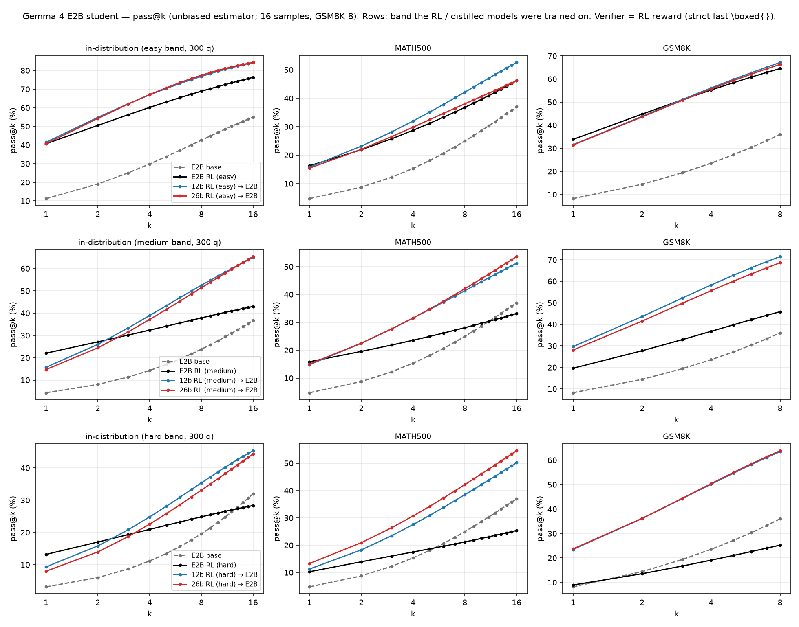
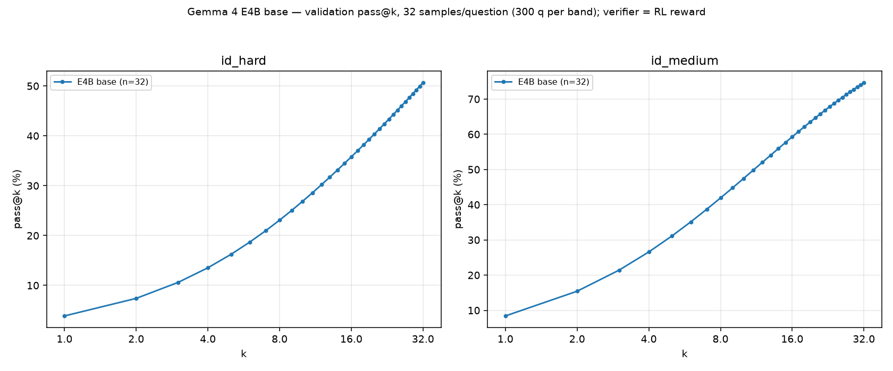

# Gemma 4 RL → Off-Policy Distillation Experiments

Distill the **RL'd** Gemma 4 policies into **base** (pretrained) Gemma 4 models, per
DeepScaleR difficulty band, using **off-policy top-128 forward-KL**. The teacher traces are
the same top-128 trace format already collected by
`scale_train/run_gemma4_bestckpt_trace_collection.sh`.

- **Models (4):** e2b, e4b, 12b, 26b-a4b (RL'd from `google/gemma-4-{E2B,E4B,12B,26B-A4B}`).
- **Datasets (3):** DeepScaleR difficulty bands **easy / medium / hard**
  (`JWei05/DeepScaleR-Easy-Medium-Hard-Gemma-26B-PT-10k`, 3000 train + 300 val per band).
- **Students (2):** `google/gemma-4-E2B` (base) and `google/gemma-4-E4B` (base) only.

## 1. Best RL checkpoint per (model, band) — in-distribution val (mean@16)

Metric `val-core/math/acc/mean@16` (W&B entity `rl-distill`, project `DAPO`, logged every 10
steps). ▸ = run still training remotely, score may still improve.

| Model | Band | Best step | mean@16 | HF checkpoint (repo @ pinned commit → `step_NNNNNN/`) |
|---|---|---|---|---|
| e2b | easy | 130 | 0.4102 | `JWei05/DAPO-gemma4-e2b-PT-DeepScaleR-gemma26b-easy-seed42-local2gpu` @ `c82460136fb1` → `step_000130/` |
| e2b | medium | 240 | 0.2250 ▸ | `JWei05/DAPO-gemma4-e2b-PT-DeepScaleR-gemma26b-medium-seed42-local2gpu` @ `497e7964f98b` → `step_000240/` |
| e2b | hard | 190 | 0.1363 | `JWei05/DAPO-gemma4-e2b-PT-DeepScaleR-gemma26b-hard-seed42-local2gpu` @ `59762d43bf94` → `step_000190/` |
| e4b | easy | 100 | 0.7056 | `JWei05/DAPO-gemma4-e4b-PT-DeepScaleR-gemma26b-easy-seed42-26b-bands-es5` @ `345beec132e3` → `step_000100/` |
| e4b | medium | 90 | 0.2998 | `JWei05/DAPO-gemma4-e4b-PT-DeepScaleR-gemma26b-medium-seed42-26b-bands-es5` @ `5f90d25e193d` → `step_000090/` |
| e4b | hard | 120 | 0.1590 | `JWei05/DAPO-gemma4-e4b-PT-DeepScaleR-gemma26b-hard-seed42-26b-bands-es5` @ `627bd9d825ff` → `step_000120/` |
| 12b | easy | 70 | 0.8408 | `JWei05/DAPO-gemma4-12b-PT-DeepScaleR-gemma26b-easy-seed42-26b-bands-es5` @ `372aa8417b09` → `step_000070/` |
| 12b | medium | 120 | 0.5208 | `JWei05/DAPO-gemma4-12b-PT-DeepScaleR-gemma26b-medium-seed42-26b-bands-es5` @ `485326ce84d0` → `step_000120/` |
| 12b | hard | 140 | 0.2767 | `JWei05/DAPO-gemma4-12b-PT-DeepScaleR-gemma26b-hard-seed42-26b-bands-es5` @ `162d85023909` → `step_000140/` |
| 26b-a4b | easy | 80 | 0.9408 | `JWei05/DAPO-gemma4-26b-a4b-PT-DeepScaleR-gemma26b-easy-seed42-26b-bands-es5` @ `f72b7fc8af90` → `step_000080/` |
| 26b-a4b | medium | 140 | 0.6725 ▸ | `JWei05/DAPO-gemma4-26b-a4b-PT-DeepScaleR-gemma26b-medium-seed42-26b-bands-es5` @ `4da4c943785f` → `step_000140/` |
| 26b-a4b | hard | 180 | 0.4329 ▸ | `JWei05/DAPO-gemma4-26b-a4b-PT-DeepScaleR-gemma26b-hard-seed42` @ `7659c94add2a` → `step_000180/` |

All 12 teachers are on the Hub (public, JWei05) and **pinned to an immutable commit** in
`run_gemma4_bestckpt_trace_collection.sh` (`TEACHER_HF_REPO` / `TEACHER_HF_REVISION`). The
`local2gpu` and 26b medium/hard repos are written by still-running RL jobs and keep only a
rolling window of recent steps on `main`, so always fetch by the pinned commit, not `main`.
e4b/12b/26b-easy are model-only re-uploads of the S3 full checkpoints' `actor/huggingface/`
(`scale_train/upload_fullckpt_to_hf.py`; the S3 originals remain under
`s3://scale-ml/genai/rl-distill/gemma4-difficulty-s42-20260819-full-checkpoints/`). The 12b
exports lack `processor_config.json`; the collector provisions it from `google/gemma-4-12B`.

▸ = run still training (2026-09-04): e2b-medium, 26b-a4b medium/hard keep improving; the pinned
steps are the W&B peaks at pin time. Re-pin (W&B best → HF step → commit) when you freeze them.

## 2. Teacher trace generation (all 12 teachers)

Every RL checkpoint above is a distillation **teacher** and needs off-policy top-128 traces:
**8** responses / train question + 1 / val question, training sampling (temp 1.0 / top-p 1.0 /
top-k −1), RL few-shot template, capturing `teacher_topk_token_ids` + `teacher_topk_logprobs`
(width 128), `input_ids`, `response_mask`. Output S3
`gemma4-bestckpt-traces-topk128-v2/<spec>/{train,validation}/`.

> **v1 is contaminated — do not use.** It was generated through an `hf_overrides →
> Gemma4ForCausalLM` (text-only) load added to work around the 12b exports' missing
> `processor_config.json`. That load mis-maps the multimodal rows of the LM head: their logits
> inflate (a multimodal id in the top-5 at ~34% of positions vs 2/1076 for the correct load),
> stealing softmax mass from real tokens (top-k logprobs deflated by up to 6.5 nats) and leaking
> `<image|>` into 71.6% of responses (100% of length-cap runaways; strict-correct 0.165
> contaminated vs 0.924 clean). Greedy argmax is preserved, so it evades greedy spot-checks and
> `bad_words` suppression (vLLM reports raw pre-mask logprobs). The RL rollout (verl) loads the
> native unified arch with no override — that is the distribution being distilled. Fix (v2):
> load the native arch; provision the base model's byte-compatible `processor_config.json` when
> an export lacks it; record `teacher_load_architectures` in the hashed run config so v1 shards
> are invalidated on resume. See memory `gemma4-vllm-unified-load-required`.

Trace collection status (2026-09-04): all 12 teachers are in the queue and every teacher is
fetched from its pinned Hub export (§1). Running now on this box (`tmux trace-queue-v2`, 8 GPUs)
as a head start that the nodes reuse via S3; the two-node split is in §6. Verified on the
regenerated v2 shards: 0% multimodal-token leakage, 0% length-cap runaways, width-128 top-k,
correct-rates tracking val (12b-easy 0.75, 26b-easy 0.97 on first shards).

Node 2's six COMPLETE bundles are published as public HF datasets with `data/upload_gemma4_trace_bundle_hf.py`
(`JWei05/gemma4-bestckpt-traces-topk128-v2-{12b-easy,12b-medium,12b-hard,e4b-easy,e4b-medium,e4b-hard}`: 375
train + 38 validation shards with manifests and run configs, the `source/` prompt rosters the view builder
needs, `dataset_index.json`, `COMPLETE.json` and the final-validation log), so `run_gemma4_distill_one.sh`
fetches them on a box that did not generate the traces.

## 3. Distillation grid (21 runs)

Teacher = best RL checkpoint (§1). Student = base model of size ≤ teacher (distill "into smaller
base models"), **plus same-size self-distillation** for e4b→e4b and e2b→e2b. Per band:

| Teacher (RL) | → e4b base | → e2b base |
|---|---|---|
| 26b-a4b | ✅ | ✅ |
| 12b | ✅ | ✅ |
| e4b | ✅ (self) | ✅ |
| e2b | — (e2b < e4b) | ✅ (self) |

**Per band: e4b base ← 3 teachers, e2b base ← 4 teachers = 7 distillations. × 3 bands = 21 runs.**
Each teacher's traces are generated once and reused across its student(s).

## 4. Distillation recipe

- **Objective:** top-128 forward-KL (`main_full_vocab_distill_fsdp2.py` /
  `gemma4_topk_distill_fsdp2.sh`; `full_vocab_kl_loss.py`). The dataset loader
  `full_vocab_distill_dataset.py` already consumes `teacher_topk_token_ids` /
  `teacher_topk_logprobs` at `teacher_topk_width=128`, `input_ids`, `response_mask` — i.e.
  **directly compatible with the traces from §2**.
- **Data:** the teacher's train traces (all 3000 q × 8 = 24,000 examples) for that band. Validation:
  128 of the teacher's own **validation-split** generations (300 val questions × 1 sample in the bundle),
  a seed-42 deterministic subset, scored by the same top-128 KL every `TEST_FREQ=10` steps
  (`build_gemma4_distill_training_view.py --validation-source validation`, the `run_gemma4_distill_one.sh`
  default; `--validation-source train` restores carving validation questions out of the train roster).
- **Hyperparameters:** global batch **64**, **500 steps** — set epochs to **100** as a
  non-binding cap so the step count is the only limit (≈1.3 epochs over 24k examples);
  LR **2.5e-6**, **100** warmup steps, **linear decay to 2.5e-7**. Micro-batching as in the audited
  production distillation: 1 sequence per micro-batch, 4096 padded-token ceiling, 4096-token KL chunks.
  Note: `gemma4_topk_distill_fsdp2.sh`'s strict 8-GPU / batch-128 contract applies only to the
  old `gemma4-hf-bf16-sdpa-topk-overlay-v1` index schema. These runs use derived training
  views (`gemma4-distill-training-view-v1`, built by `build_gemma4_distill_training_view.py`
  from each teacher's trace bundle), for which batch 64 on 1-2 GPUs flows through unchanged.
- **Compute:** FSDP2 per the audited overlay contract (`MODEL_DTYPE=fp32`, BF16 FSDP
  forward params, FP32 reductions, `Gemma4TextDecoderLayer` wrap, 4096 padded-token
  chunk, max length 12288). **e2b students on 2 GPUs, e4b students on 4 GPUs** (fp32 master + Adam
  state do not fit e2b on one GPU or e4b on two alongside activations). Runs on `.venv-gemma4`.
- **Precedent:** `e2b-base-to-e4b-topk128-lr2e6-linear-b128-2ep` used this exact schedule shape.
- **Logging / artifacts:** W&B project `gemma4-bestckpt-distill-v2` (console + wandb), validation every 10
  steps. No periodic local checkpoints (`SAVE_FREQ=0`): the trainer saves once at the final step, that save
  holds only the HF export (`checkpoint.save_contents=["hf_model"]`, no FSDP/Adam shards), it is pushed to
  `JWei05/Distill-gemma4-<teacher_spec>-to-<student>-base/step_000500/` and the local copy is deleted after
  the upload succeeds (`HF_PUSH_DELETE_LOCAL=true`). Storage is HF-only: no S3 (`TRACE_S3_MIRROR_ENABLE=false`,
  `DISTILL_S3_ENABLE=false`).

## 5. Decisions log

1. **Grid** — the 21 runs in §3 (e4b base ← {26b, 12b, e4b}; e2b base ← {26b, 12b, e4b, e2b}; × 3 bands). ✅
2. **Checkpoints on HF** — all 12 best RL checkpoints uploaded and pinned to immutable commits (§1). ✅
3. **Trace specs** — e4b steps corrected to the W&B peaks; all 12 teachers HF-sourced with pinned
   revisions; 8 samples per training question. ✅
4. **Where things run** — generation + distillation on the two remote nodes (§6), plain local
   scripts, HF-only (no S3, no ScaleTrain). Distilled students: e4b base on 4 GPUs, e2b base on
   2 GPUs (fp32 master + Adam do not fit smaller). Final distilled export = **step 500**. ✅
5. **Still-training teachers** — e2b-medium and 26b-a4b medium/hard are pinned at their W&B peaks
   at pin time (§1 ▸); re-pin (W&B best → Hub step → commit) if they are frozen later. ✅
6. **Evaluation** — the two untrained bases (needed on the new 300-q bands, MATH500 and GSM8K),
   the e2b/e4b RL teachers and every distilled student are evaluated (§7); the 12b/26b teachers are
   not. In-distribution = the model's own 300-q band (all three bands are run; the other two are
   cross-band transfer). ✅
7. **Eval throughput (2026-09-04)** — the math eval was CPU-bound: the protocol's per-token top-128
   logprobs (predictive-entropy diagnostic) made vLLM's Python output processing the bottleneck
   (~5 req/s per instance, GPU mostly idle; batching 64 questions per call only gave 1.4×). Decisions:
   (a) generation runs **without logprobs** (`EVAL_PREDICTIVE_TOPK_WIDTH=0`; entropy fields are null,
   sampled tokens unaffected, mean@k/pass@k/maj@k unchanged); (b) two models per 80 GB H100 with a
   fixed 16 GiB KV budget per vLLM instance (`kv_cache_memory_bytes` — the profiler is device-wide and
   concurrent startups on a shared GPU otherwise abort); (c) every model has its own results root. ✅

## 6. Two-node execution plan (plain local scripts — no ScaleTrain)

Everything below is plain bash run directly on a node (the scripts live under
`rl-distill-scripts/scale_train/` for historical reasons; nothing depends on ScaleTrain, and
`launch_gemma4_bestckpt_trace_matrix.py` is not used). Each node generates its teachers'
traces, then distills from them. Both phases are async GPU-pool queues; the distill queue
launches a run as soon as *its* teacher's trace bundle is COMPLETE, so it can be started right
after the trace queue on the same node.

Inputs are all on the Hub: teachers (the 12 best RL checkpoints, §1), datasets
(`JWei05/DeepScaleR-…`), students (`google/gemma-4-E4B` / `-E2B`), and the base
`processor_config.json` the 12b exports lack. **S3 is optional**: with scale-ml S3 write
access, shards mirror to `…-topk128-v2/` and nodes cooperate (completed shards are restored
and skipped); without it, set `TRACE_S3_MIRROR_ENABLE=false` and `DISTILL_S3_ENABLE=false`
and everything stays on local disk (traces under `/tmp/gemma4_bestckpt_traces_v2/`, views
under `/tmp/gemma4_distill_views/`). Prereqs per node: `.env` with `HF_TOKEN` (+ `WANDB_API_KEY`,
AWS creds if mirroring), the gemma4 venv (`bash rl-distill-scripts/setup_env_gemma4.sh`,
default `/tmp/.venv-gemma4`), 8 GPUs.

Split rationale: pair each node's slow teacher with a fast one so distillation starts early,
and balance total GPU-hours (generation + the distill runs that consume that node's teachers).
Rough GPU-hour budget (8 samples/q; distill ≈ 2 GPU·h per e2b-student run, 4 per e4b-student
run): 26b ≈ 17 gen + 18 distill, 12b ≈ 10 + 18, e4b ≈ 5 + 18, e2b ≈ 3 + 6 → node 1 ≈ 44,
node 2 ≈ 52 (vs ≈ 58 / 38 for a 26b+e4b / 12b+e2b split). Each node distills only from teachers
it generated, so there is no cross-node dependency.

| | Node 1 (teachers 26b + e2b) | Node 2 (teachers 12b + e4b) |
|---|---|---|
| **Traces** | 26b easy/medium/hard (2 GPUs, **TP2**) · e2b easy/medium/hard (1 GPU) | 12b easy/medium/hard (2 GPUs, DP2) · e4b easy/medium/hard (2 GPUs, DP2) |
| **Distill** | 26b→e4b (4 GPUs) · 26b→e2b, e2b→e2b (2 GPUs) — **9 runs** | 12b→e4b, e4b→e4b (4 GPUs) · 12b→e2b, e4b→e2b (2 GPUs) — **12 runs** |

```bash
# ---- node 1 ----
TRACE_QUEUE_SPECS=26b-easy:2,26b-medium:2,26b-hard:2,e2b-easy:1,e2b-medium:1,e2b-hard:1 \
  VENV=/tmp/.venv-gemma4 GPU_MEMORY_UTILIZATION=0.72 \
  bash rl-distill-scripts/scale_train/run_gemma4_bestckpt_trace_queue.sh
DISTILL_QUEUE_RUNS=26b-easy:e4b:4,26b-medium:e4b:4,26b-hard:e4b:4,26b-easy:e2b:2,26b-medium:e2b:2,26b-hard:e2b:2,e2b-easy:e2b:2,e2b-medium:e2b:2,e2b-hard:e2b:2 \
  bash rl-distill-scripts/scale_train/run_gemma4_distill_queue.sh

# ---- node 2 ----
TRACE_QUEUE_SPECS=12b-easy:2,12b-medium:2,12b-hard:2,e4b-easy:2,e4b-medium:2,e4b-hard:2 \
  VENV=/tmp/.venv-gemma4 GPU_MEMORY_UTILIZATION=0.72 \
  bash rl-distill-scripts/scale_train/run_gemma4_bestckpt_trace_queue.sh
DISTILL_QUEUE_RUNS=12b-easy:e4b:4,12b-medium:e4b:4,12b-hard:e4b:4,e4b-easy:e4b:4,e4b-medium:e4b:4,e4b-hard:e4b:4,12b-easy:e2b:2,12b-medium:e2b:2,12b-hard:e2b:2,e4b-easy:e2b:2,e4b-medium:e2b:2,e4b-hard:e2b:2 \
  bash rl-distill-scripts/scale_train/run_gemma4_distill_queue.sh
```

Queue knobs used on node 2 (2026-09-04):

- **Sharing the node with the trace queue.** Start the distill queue with `DISTILL_QUEUE_DYNAMIC_GPUS=true
  DISTILL_QUEUE_RESERVED_GPUS_LOG=<trace queue stdout log>` once the trace queue has launched every
  collection. It then takes only GPUs that have no compute process *and* are not named in an open
  `QUEUE launch spec=… gpus=…` entry of that log (a just-launched vLLM worker holds no GPU memory for its
  first minute, so nvidia-smi alone is not enough), so distillation fills each pair the moment a collection
  finishes.
- **Per-run overrides.** A fourth run-spec field sets runner environment for one run, e.g.
  `e4b-easy:e4b:4:LR=1e-6` (several with `;`). Used to redo the e4b→e4b self-distillations at peak lr 1e-6:
  at 2.5e-6 their validation KL bottomed near step 80 and rose afterwards (0.036→0.048 easy, 0.028→0.039
  medium); at 1e-6 it kept falling to 0.011 / 0.012 / 0.0066 (easy / medium / hard) by step 500.
- **e2b students on 2 GPUs need the 2048-token KL chunk** (`run_gemma4_distill_one.sh` sets it per student):
  with 4096 the 12b-medium traces ran the pair to 81.1/81.5 GB and the cuDNN attention backward failed.

Single runs: `TEACHER_SPEC=12b-easy STUDENT=e4b DISTILL_GPU_IDS=0,1,2,3 bash
rl-distill-scripts/scale_train/run_gemma4_distill_one.sh` (recipe defaults: bs 64, 500 steps,
epochs cap 100, lr 2.5e-6, warmup 100, linear → 2.5e-7; pin `STUDENT_REVISION` for reproducible
student identities). Smoke-test one teacher on a node with `TRACE_MAX_SHARDS=1` /
one `run_gemma4_distill_one.sh` before the full queues.

Trace/distill identity: the generator hashes only its own source + config (not the git
commit), so nodes may be at different commits as long as `generate_gemma4_distill_traces.py`
is byte-identical; a change to that file requires a new trace version (bump the `-v2` prefixes).

## 7. Evaluation suite (bases, RL students, distilled students)

Roster (`config/gemma4_distill_study_eval_sources.json`, regenerated by
`data/build_gemma4_distill_study_eval_registry.py`): the **two base students** (`google/gemma-4-E2B`,
`-E4B`, pinned), the **six small RL teachers** (e2b/e4b × easy/medium/hard, pinned to the Hub
commits in §1 — the 12b/26b teachers are not evaluated) and **every distilled student** found on
the Hub (`Distill-gemma4-*` / `gemma4-distill-v2-*`, final `step_000500/` exports, `main` commit
pinned at discovery; empty in-progress repos are skipped, existing pins are kept). Re-run the
builder as distillations finish.

Per model, one generation protocol for all math sets (temp 1.0 / top-p 1.0 / top-k −1, 8192 max
tokens, 12-shot `gemma3_it_fewshot_math.jinja`), scored with **exactly the RL reward**
(`verl.utils.reward_score.math_verify.compute_score`, strict last-`\boxed{}`, 30 s verify, 5 s
SymPy fallback — pinned via `VERL_MATH_VERIFY_*` in the runner; correct ⇔ score > 0.5):

| Family | Sets | Metrics |
|---|---|---|
| In-distribution | `id_easy`, `id_medium`, `id_hard` — the pinned 300-q band validation splits of `JWei05/DeepScaleR-Easy-Medium-Hard-Gemma-26B-PT-10k@a0ba3c3d` (a model's own band is its ID number; the other two are cross-band transfer) | mean@16, pass@16 (+maj@16) |
| OOD math | MATH500 (`HuggingFaceH4/MATH-500`) ×16; GSM8K (`openai/gsm8k` test) ×8 | mean@16 / pass@16; mean@8 / pass@8 |
| Out-of-domain | MMLU-Pro (5-shot CoT), GPQA-Diamond (5-shot CoT), MMLU-14k (`openai/MMMLU`, 14 locales × 1003) | accuracy via pinned lm-eval-harness (`eval_gemma4_ood.py`) — **a different scorer; never compare with the math family** |

Manifest protocol `gemma4_rl_distill_math_eval_v2` (v1 = the earlier 500-q Easy-10k/Medium-20k
splits; results are kept apart under `s3://scale-ml/genai/rl-distill/gemma4-distill-study-evals-v1/`).
Per model ≈ 33k math generations + 26k OOD items (≈ 2.5 min of generation per 4,800 short-answer
requests without logprobs; the per-dataset scoring/answer-class pass and the Monte-Carlo aggregation
add a few CPU minutes each).

Runtime knobs (all defaults set by the queue; the manifest protocol itself is unchanged):
`MATH_QUESTIONS_PER_BATCH=64` / `MATH_REQUEST_BATCH_SIZE=1024` batch several questions' seeded
requests per vLLM call (every request carries its own deterministic seed, so the sampled set does not
depend on batching); `EVAL_PREDICTIVE_TOPK_WIDTH=0` requests **no per-token logprobs** (the
predictive-entropy diagnostics are recorded as null; with top-128 logprobs each eval was CPU-bound in
vLLM's Python output processing at ~5 req/s); `EVAL_KV_CACHE_GIB=16` fixes each vLLM instance's KV
budget so two models can share an 80 GB H100; `EVAL_GPU_MEMORY_UTILIZATION=0.40` (only gates vLLM's startup free-memory check; the KV budget is fixed).

```bash
# Local GPU-pool queue (the way the study is evaluated): 2 models per 80 GB H100 (EVAL_QUEUE_SLOTS_PER_GPU),
# no per-token logprobs (EVAL_PREDICTIVE_TOPK_WIDTH=0), fixed EVAL_KV_CACHE_GIB=16 KV budget per vLLM
# instance (its memory profiler is device-wide, so concurrent startups on a shared GPU otherwise mis-size
# each other and abort). Full suite per model (math -> OOD -> RUN_COMPLETE.json); the next roster entry
# starts as soon as a slot frees. Override any knob by exporting it before launch. The roster
# is refreshed from the Hub every 10 polls, so distilled students are picked up as they finish;
# models with RUN_COMPLETE.json are skipped (safe to restart). After every completed model §8 below
# is regenerated from the result files and committed/pushed.
tmux new-session -d -s eval-queue \
  "EVAL_QUEUE_GPUS=4,5,6,7 bash rl-distill-scripts/scale_train/run_gemma4_distill_study_eval_queue.sh \
     2>&1 | tee -a /tmp/gemma4_distill_study_eval/eval_queue.log"
# monitor
grep -E "EVAL_QUEUE (launch|done|FAILED|skip)" /tmp/gemma4_distill_study_eval/eval_queue.log
/tmp/.venv-gemma4/bin/python rl-distill-scripts/eval_queue_progress.py      # per-model progress + ETA table
tail -3 /tmp/gemma4_distill_study_eval/queue_logs/<tag>.log        # per-model driver log
ls /tmp/gemma4_distill_study_eval/results/<tag>/{<tag>/math/metrics.json,<tag>/ood/*/complete.json,RUN_COMPLETE.json}
# manual pieces
/tmp/.venv-gemma4/bin/python rl-distill-scripts/data/build_gemma4_distill_study_eval_registry.py   # refresh roster
MODEL_TAG=rl_e2b_easy GPU_COUNT=1 PACKED_PHYSICAL_GPU_IDS=4 \
  bash rl-distill-scripts/scale_train/run_gemma4_rl_distill_eval_one_model.sh                       # one model
/tmp/.venv-gemma4/bin/python rl-distill-scripts/update_distill_study_results_doc.py                  # rebuild §8
```

### 7.1 Splitting the suite across machines (OOD elsewhere)

`EVAL_PHASES` (runner and queue; default `math,ood`) selects the suites, so the math family can run
here while the out-of-domain benchmarks run on another box. **Current policy (2026-09-04): the local
queue runs `EVAL_PHASES=math` — all math first, OOD later/elsewhere.** A queue never double-launches a
model whose runner is alive from a previous queue (it waits, then launches it math-only; the math
runner resumes from finished shards, so nothing is regenerated). Per-model results are independent files,
and `RUN_COMPLETE.json` records the phases a machine finished.

**Other machine, once** (any CUDA 12.x/13 host; needs `HF_TOKEN` in `.env`):
```bash
git clone <this repo> rl-distill && cd rl-distill
git clone https://github.com/EleutherAI/lm-evaluation-harness lm-evaluation-harness \
  && git -C lm-evaluation-harness checkout f4d4b3de3ee6741a7151a9fe74945ee515262f4c   # pinned; the repo only holds a gitlink
VENV=/tmp/.venv-gemma4 GEMMA4_CUDA_VARIANT=cu129 bash rl-distill-scripts/setup_env_gemma4.sh        # cu130 for CUDA-13 drivers
uv pip install --python /tmp/.venv-gemma4/bin/python --no-deps -e ./lm-evaluation-harness          # lm_eval 0.4.13.dev0
```
**Other machine, run the OOD suite** (models are materialized from the pinned Hub commits in the registry):
```bash
# whole roster, 2 models per 80 GB GPU, results under /tmp/gemma4_distill_study_eval/results/<tag>/
# (EVAL_QUEUE_COMMIT_DOC=false: the OOD box must not commit §8; EVAL_QUEUE_WAIT_FOR_NEW=false: exit when the
#  roster is done instead of idling for new distilled students; EVAL_QUEUE_TAGS="rl_e2b_medium rl_e2b_hard"
#  restricts the roster to a subset; VENV points at the repo-local venv if that is where the harness is installed)
EVAL_PHASES=ood EVAL_S3_ENABLE=false EVAL_QUEUE_COMMIT_DOC=false EVAL_QUEUE_WAIT_FOR_NEW=false \
  EVAL_QUEUE_GPUS=0,1,2,3,4,5,6,7 bash rl-distill-scripts/scale_train/run_gemma4_distill_study_eval_queue.sh
# or one model
EVAL_PHASES=ood EVAL_S3_ENABLE=false MODEL_TAG=rl_e2b_easy GPU_COUNT=1 PACKED_PHYSICAL_GPU_IDS=0 \
  bash rl-distill-scripts/scale_train/run_gemma4_rl_distill_eval_one_model.sh
```
(`EVAL_S3_ENABLE=true` instead mirrors to `s3://scale-ml/genai/rl-distill/gemma4-distill-study-evals-v1/<tag>/`
if the host has the `ml-worker` profile.) **This machine, math only:** relaunch the queue with
`EVAL_PHASES=math`. **Merging:** copy each `results/<tag>/<tag>/ood/` directory from the other machine
into the same path under this box's results base (or `aws s3 sync <prefix>/ /tmp/gemma4_distill_study_eval/results/`),
then `python rl-distill-scripts/update_distill_study_results_doc.py` fills the OOD columns of §8.
The OOD numbers also travel with the repo: the OOD box writes
`rl-distill-scripts/config/gemma4_distill_study_ood_summary.json` (`summarize_gemma4_ood_results.py`,
accuracies + result-file sha256s, no samples) and the updater reads it with `--summary <file>` on any
machine; `--fallback-from-doc` keeps the other family's cells already in §8 when a box has data for only
one family (that is how the OOD box refreshes its columns without blanking the math numbers).

Results land under `/tmp/gemma4_distill_study_eval/results/<tag>/` — one root per model:
`<tag>/math/metrics.json`, `<tag>/math/traces/*.jsonl`, `<tag>/ood/<bench>/`, `RUN_COMPLETE.json` —
mirrored to `s3://scale-ml/genai/rl-distill/gemma4-distill-study-evals-v1/<tag>/`.

## 8. Results (updated as each model finishes)

Numbers are copied here by `rl-distill-scripts/update_distill_study_results_doc.py`, which scans
the per-model result files under the study results root and rewrites everything between the two
markers below; run it after any model completes (or let the packed run's watcher do it). Math
numbers (repo `\boxed{}` verifier = the RL reward) and OOD accuracies (lm-eval-harness) are
separate families — do not compare across them. Bold = a model's own band (in-distribution).
All percentages; `mean@k` = average accuracy over k samples, `pass@k` = any-of-k.

**Status (2026-09-05 01:00Z): math suite complete for all 29 models of the study** (2 bases, 6 RL, the full
21-run distillation grid). Generation ran 2026-09-04 16:58Z – 2026-09-05 01:00Z on 7 H100s (2 models per GPU, no
logprobs, per-dataset resume). OOD (MMLU-Pro / GPQA-Diamond / MMLU-14k) is deferred for all models (`EVAL_PHASES=math`;
run it with `EVAL_PHASES=ood` here or on another machine, §7.1). Every RL model's own-band mean@16 matched its W&B
validation best within ~1 point. Note: `e4b-hard→e2b` exists twice on the Hub (`Distill-gemma4-…` and
`gemma4-distill-v2-…`); only the first is rostered (the builder dedupes directions and warns).

**Pipeline check (2026-09-04):** a 1-GPU smoke of `rl_e2b_easy` on `id_easy` (300 q × 16, same verifier
and prompt as the queue) gave mean@16 **40.8** / pass@16 77.0 / maj@16 47.0 — the RL run's own W&B
validation best for that checkpoint was 41.0, so the offline suite reproduces the training-time number.
Re-running it with cross-question batching (64 q × 16 per vLLM call, the queue setting) gave 40.4 / 76.7 / 47.0
with identical per-request seeds (70 % of sequences byte-identical; the rest differ by batch-composition numerics).

<!-- results:start -->
_Updated 2026-09-07 00:01Z — math complete for 31/31 models, OOD complete for 29/31. Partial rows are shown as they finish._

**Math family** — `mean@k / pass@k` (%), repo `\boxed{}` verifier (= RL reward). Bold = own band.

| Model | Category | Trained on | id_easy (16) | id_medium (16) | id_hard (16) | MATH500 (16) | GSM8K (8) |
|---|---|---|---|---|---|---|---|
| `base_12b` | base | — | 42.3 / 97.0 | 14.1 / 72.0 | 5.3 / 45.0 | 17.2 / 59.4 | 46.1 / 88.1 |
| `base_26b` | base | — | 62.3 / 99.7 | 23.8 / 86.3 | 9.9 / 69.7 | 27.2 / 71.8 | 56.7 / 93.6 |
| `base_e2b` | base | — | 11.2 / 55.0 | 4.3 / 36.7 | 3.1 / 32.0 | 4.8 / 37.0 | 8.2 / 36.0 |
| `base_e4b` | base | — | 29.6 / 89.3 | 8.6 / 60.3 | 4.2 / 38.0 | 10.9 / 50.6 | 26.4 / 72.6 |
| `rl_e2b_easy` | rl | easy | **40.7 / 76.3** | 17.0 / 57.7 | 8.4 / 39.0 | 16.3 / 46.2 | 33.8 / 64.5 |
| `rl_e2b_hard` | rl | hard | 21.1 / 46.3 | 16.3 / 40.0 | **13.2 / 28.3** | 10.3 / 25.4 | 8.9 / 25.2 |
| `rl_e2b_medium` | rl | medium | 34.6 / 54.3 | **22.1 / 43.0** | 16.0 / 38.7 | 15.9 / 33.2 | 19.6 / 45.9 |
| `rl_e4b_easy` | rl | easy | **69.9 / 95.3** | 32.8 / 77.3 | 19.2 / 56.0 | 31.5 / 63.6 | 69.5 / 88.9 |
| `rl_e4b_hard` | rl | hard | 39.9 / 79.3 | 20.0 / 56.7 | **15.4 / 47.7** | 16.7 / 48.0 | 43.0 / 77.4 |
| `rl_e4b_medium` | rl | medium | 62.2 / 94.3 | **29.1 / 71.3** | 17.2 / 58.3 | 26.5 / 61.6 | 65.4 / 88.9 |
| `distill_12b_easy_to_e2b` | distilled | easy | **41.5 / 84.3** | 13.4 / 61.3 | 7.8 / 44.3 | 15.8 / 52.6 | 31.5 / 67.2 |
| `distill_26b_easy_to_e2b` | distilled | easy | **40.7 / 84.3** | 13.4 / 61.3 | 6.4 / 36.3 | 15.5 / 46.2 | 31.4 / 66.3 |
| `distill_e2b_easy_to_e2b` | distilled | easy | **38.9 / 79.3** | 16.9 / 59.7 | 7.7 / 40.0 | 15.9 / 47.2 | 32.4 / 65.1 |
| `distill_e4b_easy_to_e2b` | distilled | easy | **38.0 / 84.7** | 14.8 / 62.0 | 7.6 / 41.7 | 15.3 / 48.6 | 32.3 / 70.4 |
| `distill_12b_hard_to_e2b` | distilled | hard | 29.5 / 81.3 | 12.8 / 62.0 | **9.3 / 45.3** | 11.3 / 50.2 | 23.5 / 63.5 |
| `distill_26b_hard_to_e2b` | distilled | hard | 31.0 / 85.7 | 12.9 / 69.3 | **8.0 / 44.3** | 13.3 / 54.6 | 23.7 / 63.8 |
| `distill_e2b_hard_to_e2b` | distilled | hard | 19.6 / 47.7 | 15.7 / 39.3 | **13.1 / 31.0** | 10.0 / 28.0 | 8.4 / 25.7 |
| `distill_e4b_hard_to_e2b` | distilled | hard | 19.8 / 65.0 | 12.4 / 46.3 | **12.1 / 45.0** | 8.6 / 39.6 | 13.4 / 45.2 |
| `distill_12b_medium_to_e2b` | distilled | medium | 36.7 / 87.0 | **15.8 / 65.0** | 8.7 / 51.3 | 14.8 / 51.2 | 29.6 / 71.5 |
| `distill_26b_medium_to_e2b` | distilled | medium | 34.3 / 86.7 | **14.7 / 65.3** | 8.7 / 45.7 | 15.1 / 53.6 | 28.0 / 68.6 |
| `distill_e2b_medium_to_e2b` | distilled | medium | 33.9 / 58.3 | **21.7 / 42.3** | 16.3 / 37.0 | 15.4 / 34.8 | 19.2 / 46.2 |
| `distill_e4b_medium_to_e2b` | distilled | medium | 33.1 / 81.7 | **14.0 / 62.3** | 10.2 / 49.0 | 13.3 / 46.2 | 25.9 / 62.7 |
| `distill_12b_easy_to_e4b` | distilled | easy | **66.9 / 96.0** | 27.2 / 79.7 | 14.2 / 60.0 | 27.4 / 61.6 | 62.8 / 87.4 |
| `distill_26b_easy_to_e4b` | distilled | easy | **67.6 / 95.7** | 26.8 / 78.7 | 13.7 / 53.3 | 29.1 / 64.2 | 64.7 / 90.7 |
| `distill_e4b_easy_to_e4b` | distilled | easy | **69.5 / 97.0** | 31.5 / 77.0 | 17.7 / 53.7 | 31.2 / 64.4 | 69.0 / 91.0 |
| `distill_12b_hard_to_e4b` | distilled | hard | 60.6 / 99.0 | 28.3 / 83.7 | **17.0 / 60.7** | 26.8 / 65.4 | 61.4 / 89.9 |
| `distill_26b_hard_to_e4b` | distilled | hard | 67.8 / 99.3 | 32.8 / 88.7 | **17.6 / 72.0** | 33.2 / 73.2 | 66.2 / 92.8 |
| `distill_e4b_hard_to_e4b` | distilled | hard | 38.9 / 81.0 | 19.3 / 55.3 | **15.2 / 46.7** | 16.2 / 48.0 | 43.1 / 78.9 |
| `distill_12b_medium_to_e4b` | distilled | medium | 68.0 / 96.3 | **32.9 / 82.7** | 19.3 / 65.0 | 33.5 / 67.6 | 69.0 / 93.3 |
| `distill_26b_medium_to_e4b` | distilled | medium | 71.3 / 99.0 | **37.5 / 89.3** | 20.4 / 69.7 | 34.3 / 71.8 | 67.3 / 92.1 |
| `distill_e4b_medium_to_e4b` | distilled | medium | 62.2 / 93.7 | **28.5 / 75.7** | 16.2 / 55.0 | 26.1 / 60.2 | 64.1 / 88.6 |

**Out-of-domain** — accuracy (%), lm-eval-harness 5-shot CoT (different scorer; not comparable to the math family).

| Model | MMLU-Pro | GPQA-Diamond | MMLU-14k |
|---|---|---|---|
| `base_12b` | — | — | — |
| `base_26b` | — | — | — |
| `base_e2b` | 23.9 | 22.7 | 48.2 |
| `base_e4b` | 37.9 | 19.2 | 61.6 |
| `rl_e2b_easy` | 28.4 | 24.2 | 48.2 |
| `rl_e2b_hard` | 26.0 | 21.7 | 47.6 |
| `rl_e2b_medium` | 27.0 | 24.7 | 47.8 |
| `rl_e4b_easy` | 44.0 | 20.2 | 60.7 |
| `rl_e4b_hard` | 40.2 | 24.2 | 59.4 |
| `rl_e4b_medium` | 43.9 | 26.3 | 61.3 |
| `distill_12b_easy_to_e2b` | 27.1 | 20.7 | 48.4 |
| `distill_26b_easy_to_e2b` | 27.3 | 26.3 | 48.6 |
| `distill_e2b_easy_to_e2b` | 28.0 | 20.2 | 48.4 |
| `distill_e4b_easy_to_e2b` | 27.1 | 19.7 | 48.1 |
| `distill_12b_hard_to_e2b` | 27.3 | 20.2 | 47.8 |
| `distill_26b_hard_to_e2b` | 24.6 | 18.7 | 47.8 |
| `distill_e2b_hard_to_e2b` | 25.7 | 25.3 | 48.0 |
| `distill_e4b_hard_to_e2b` | 25.9 | 25.8 | 47.1 |
| `distill_12b_medium_to_e2b` | 23.9 | 19.2 | 48.2 |
| `distill_26b_medium_to_e2b` | 25.0 | 17.7 | 48.3 |
| `distill_e2b_medium_to_e2b` | 26.8 | 19.7 | 48.1 |
| `distill_e4b_medium_to_e2b` | 26.3 | 24.2 | 47.9 |
| `distill_12b_easy_to_e4b` | 39.0 | 18.7 | 57.6 |
| `distill_26b_easy_to_e4b` | 41.5 | 24.7 | 60.0 |
| `distill_e4b_easy_to_e4b` | 44.1 | 24.7 | 60.9 |
| `distill_12b_hard_to_e4b` | 41.6 | 22.7 | 58.5 |
| `distill_26b_hard_to_e4b` | 41.4 | 21.7 | 59.8 |
| `distill_e4b_hard_to_e4b` | 40.3 | 20.7 | 59.5 |
| `distill_12b_medium_to_e4b` | 39.6 | 14.6 | 58.9 |
| `distill_26b_medium_to_e4b` | 41.4 | 19.2 | 59.6 |
| `distill_e4b_medium_to_e4b` | 43.7 | 26.3 | 61.1 |
<!-- results:end -->

### 8.1 pass@k curves — E4B student


`figures/passk_e4b.png` (regenerate with `python rl-distill-scripts/plot_distill_study_passk.py --student e4b
--teachers 12b 26b`): unbiased pass@k (Chen et al.) from the per-sample traces, k = 1..16 (GSM8K 1..8).
Rows = the band the RL / distilled models were trained on; columns = that band, MATH500, GSM8K; curves =
untrained E4B base, E4B RL, and the E4B students distilled from the 12b and 26b RL teachers (E4B→E4B
self-distillation omitted). Read (2026-09-04, all 22 exported models): on the **easy** band the four trained
curves are indistinguishable (RL leads at k=1 by 2–3 points, 12b/26b students catch up by k=4). On **medium** and
**hard** the big-teacher students dominate RL at every k and the gap widens with k (hard band pass@16: 26b→E4B
72, 12b→E4B 61, RL 48, base 38; MATH500 from the hard-band models: 73 / 65 / 48 / 51 — hard-band RL does not
beat the base at k=16 on MATH500, the distilled students do by 15–22 points). GSM8K follows the same order
except for the easy band, where RL is best at small k.

### 8.2 pass@k curves — E2B student



`figures/passk_e2b.png` (`python rl-distill-scripts/plot_distill_study_passk.py --student e2b --teachers 12b 26b`;
add `e4b` to `--teachers` for the e4b-teacher students), same layout as §8.1 with E2B→E2B self-distillation omitted.
Read (2026-09-05): the curves **cross**. On every band the RL model leads at k=1 (medium 22.1 vs 15.8/14.7, hard
13.2 vs 9.3/8.0) but the 12b/26b-distilled students overtake it by k≈2–3 and end far ahead at k=16 (medium 65 vs 43,
hard 45 vs 28). On the easy band the distilled students are ahead at every k (pass@16 84 vs 76). Transfer shows the
same shape: medium/hard-band RL barely beats the base on MATH500 and GSM8K at k=16 (hard-band RL is *below* the base
on both), while the distilled students reach 50–55 on MATH500 and 64–72 on GSM8K. So for the 2B student, RL sharpens
single-sample accuracy on its band; distillation from a bigger teacher broadens coverage and transfers, at a cost in
mean@16 on medium/hard.

## 9. Pre-training control: E4B *base* teacher → 12B / 26B students (started 2026-09-06)

Goal: separate what distillation transfers from what the teacher's pre-training already knows, by
distilling traces from the **untrained** Gemma 4 E4B PT model (`google/gemma-4-E4B` @ `411aa17b`)
into the larger 12B and 26B-A4B bases on the **medium** and **hard** bands.

**Step 1 — trace generation (running locally):** same sampler and prompt as every trace bundle in
this study (temp 1.0 / top-p 1.0 / top-k −1, 8192 max response tokens, 12-shot
`data/gemma3_it_fewshot_math.jinja`), **16 responses per training question, 1 per validation
question**, with top-128 logprobs + token ids per position. Two collections run at once, each with
2 GPUs as 2 data-parallel workers (TP 1):

```bash
# spec e4b-base-medium on GPUs 0,5 and e4b-base-hard on GPUs 6,7 (tmux trace-<spec>)
TRACE_SPEC=e4b-base-medium TRACE_GPU_IDS=0,5 TENSOR_PARALLEL_SIZE=1 TRAIN_SAMPLES_PER_QUESTION=16 \
  VALIDATION_SAMPLES_PER_QUESTION=1 VENV=/tmp/.venv-gemma4 AWS_PROFILE=ml-worker \
  bash rl-distill-scripts/scale_train/run_gemma4_bestckpt_trace_collection.sh
TRACE_SPEC=e4b-base-hard TRACE_GPU_IDS=6,7 ... (same)
# progress: ls /tmp/gemma4_e4b_base_traces_v1/<spec>/{train,validation}/*.parquet | wc -l ; logs under <spec>/logs/
```

The `e4b-base-*` specs (collection script) pull the base repo root (no `step_NNNNNN/`), default to 16
train samples, and write to `/tmp/gemma4_e4b_base_traces_v1/<spec>/` mirrored to
`s3://scale-ml/genai/rl-distill/gemma4-e4b-base-traces-topk128-v1/<spec>/` (bundle `COMPLETE.json`
at the end; directions `e4b_base_{medium,hard}_to_12b_26b`). Source data = the band train split
(3,000 q) and the 300-q validation split of `JWei05/DeepScaleR-Easy-Medium-Hard-Gemma-26B-PT-10k@a0ba3c3d`.

**Step 2 (prepared, not started — needs the bundles and all 8 GPUs):** distill into `google/gemma-4-12B`
(@ `023679ed`) and `google/gemma-4-26B-A4B` (@ `24548b62`) with the §4 recipe (top-128 forward KL, bs 64,
500 steps, lr 2.5e-6 → 2.5e-7). The launcher now accepts `STUDENT=12b|26b` (8-GPU floor, fp32 master +
Adam; 12B wraps `Gemma4UnifiedTextDecoderLayer`, 26B-A4B `Gemma4TextDecoderLayer`), picks the e4b-base
trace family for `TEACHER_SPEC=e4b-base-*` (16 train samples, no HF dataset mirror), and exposes
`FSDP_OFFLOAD=true` (params **and** optimizer together — verl's engine rejects offloading only one) for the 26B footprint. Tokenizer identity verified: E4B, 12B
and 26B-A4B share the same tokenizer fingerprint (262,144 tokens), which the top-k KL preflight requires.

```bash
# one run per (band, student); 4 runs total, sequential on 8 GPUs (each ~ the §4 recipe's wall time)
TEACHER_SPEC=e4b-base-medium STUDENT=12b DISTILL_GPU_IDS=0,1,2,3,4,5,6,7 bash rl-distill-scripts/scale_train/run_gemma4_distill_one.sh
TEACHER_SPEC=e4b-base-medium STUDENT=26b DISTILL_GPU_IDS=0,1,2,3,4,5,6,7 FSDP_OFFLOAD=true bash rl-distill-scripts/scale_train/run_gemma4_distill_one.sh
# ... e4b-base-hard likewise; students push to JWei05/Distill-gemma4-e4b-base-<band>-to-<student>-base/step_000500
```
Then evaluate with §7 (math suite first). The registry builder now rosters the 12B and 26B-A4B bases
(`base_12b`, `base_26b`, the control baselines) and discovers `…-e4b-base-<band>-to-(12b|26b)-base` students
(tags `distill_e4b_base_<band>_to_<student>`). Note for the queue: a 26B-A4B model (52 GB bf16) needs one
eval slot per GPU (`EVAL_QUEUE_SLOTS_PER_GPU=1`), and the eval queue must not share GPUs with a running
distillation (it only sees other eval runners).

**Target:** the distilled 12B / 26B students should reproduce the E4B teacher's **pass@k curve** on the
in-distribution validation set of their band (not just mean@16). Reference curves: the E4B base sampled
**32×** per validation question (protocol `gemma4_rl_distill_math_eval_v2_x32`, k = 1..32):

```bash
# manifest variant (only id_medium / id_hard at 32 samples; everything else as v2)
python rl-distill-scripts/data/prepare_gemma4_rl_distill_eval_data.py --output-dir /tmp/gemma4_e4b_val32/data \
  --overwrite --samples-override "id_medium=32,id_hard=32" --protocol gemma4_rl_distill_math_eval_v2_x32
# one eval per band (E4B base; identical sampler/prompt/verifier to the study), then the curves:
python rl-distill-scripts/eval_math_passk.py --model <E4B base dir> --expected_model_identity_sha256 <sha> --tag base_e4b \
  --datasets /tmp/gemma4_e4b_val32/data/id_medium.parquet --dataset_manifest /tmp/gemma4_e4b_val32/data/math_eval_manifest.json \
  --out /tmp/gemma4_e4b_val32/id_medium/metrics.json --trace_dir /tmp/gemma4_e4b_val32/id_medium/traces --ks 1 2 4 8 16 32 \
  --temperature 1.0 --top_k -1 --top_p 1.0 --max_tokens 8192 --max_prompt_tokens 4096 --max_model_len 12288 \
  --predictive_topk_width 0 --request_batch_size 2048 --questions_per_batch 64 --subset_strategy monte_carlo --monte_carlo_resamples 4096
python rl-distill-scripts/plot_passk_from_traces.py --out rl-distill-scripts/figures/passk_e4b_base_val32.png \
  --trace "E4B base=/tmp/gemma4_e4b_val32/id_medium/traces/base_e4b__id_medium.jsonl" --trace "E4B base=/tmp/gemma4_e4b_val32/id_hard/traces/base_e4b__id_hard.jsonl"
```
Evaluate each student checkpoint with the same ×32 protocol and add its trace to the plot to compare curves.

**Step 2 hyperparameters — what we ran before vs. these runs (run off this box, 4 GPUs each):**

| | e2b/e4b students (§4, 2026-09-04) | 12B / 26B-A4B students (§9) |
|---|---|---|
| data | 3,000 q × 8 teacher samples = 24k rows | 3,000 q × 16 = 48k rows (`TRAIN_SAMPLES_PER_QUESTION=16`) |
| global batch / steps | 64 / 500 (≈1.3 epochs) | **128 / 1000** (≈2.7 epochs; `TOTAL_EPOCHS=100` cap) |
| LR schedule | 2.5e-6 peak, 100 warmup, linear → 2.5e-7 | **2e-6** peak, 100 warmup, linear → 2e-7 (`MIN_LR_RATIO=0.1`) |
| micro-batching | 1 seq / micro-batch, 4096 padded-token ceiling, KL chunk 4096 (e4b) / 2048 (e2b) | same; KL chunk 2048 (12B) / 1024 (26B) |
| precision / FSDP | fp32 master + Adam, bf16 param views, grad ckpt, max_length 12288 | same; 12B fits on 4×H100 (67–77 GB); 26B-A4B on 4 GPUs needs `FSDP_OFFLOAD=true` (8 GPUs preferred) |
| validation | top-128 KL on 128 teacher val generations every 10 steps | same (`TEST_FREQ=10`); plus pass@k×32 on every saved checkpoint |
| checkpoints | final only (`SAVE_FREQ=0`), HF export only | **every 50 steps** (`ROLLING_CHECKPOINT_FREQ=50`): full resumable checkpoint (fp32 model + Adam + LR/RNG `extra` + dataloader position `data_<rank>.pt`) + HF export pushed to the Hub as `step_000050 … step_001000` (20 pass@k points); the checkpoint goes to a single rolling S3 slot `…/rolling/` (background upload) except every 250 steps (`SAVE_FREQ=250`), when it is kept **permanently** in S3 and retires the rolling slot. Startup restores the newest of permanent/rolling — borrowed ScaleTrain pods get preempted and restart the run-file, losing ≤50 steps. Pods (role `eks-ml-worker2`) cannot delete S3 objects, so stale rolling steps are pruned by `scale_train/prune_rolling_checkpoints.sh` running on this box (tmux `ckpt-janitor`, every 30 min) |
| wrap class | `Gemma4TextDecoderLayer` | 12B `Gemma4UnifiedTextDecoderLayer`, 26B-A4B `Gemma4TextDecoderLayer` (set by `STUDENT`) |

```bash
# on a node with the repo + .venv-gemma4 + .env (HF_TOKEN, WANDB_API_KEY); bundles are fetched from S3 (or copy the local dirs)
COMMON="TRAIN_BATCH_SIZE=128 LR=2e-6 TOTAL_TRAINING_STEPS=1000 LR_WARMUP_STEPS=100 MIN_LR_RATIO=0.1 TEST_FREQ=10 SAVE_FREQ=250 ROLLING_CHECKPOINT_FREQ=50 ROLLING_HF_EXPORT=true HF_PUSH_MAX_TO_KEEP=24 \
        CHECKPOINT_SAVE_CONTENTS='["model","optimizer","extra","hf_model"]' MAX_CKPT_TO_KEEP=1 HF_PUSH_DELETE_LOCAL=false \
        REMOTE_CHECKPOINT_ENABLE=true REMOTE_CHECKPOINT_S3_URI=s3://scale-ml/genai/rl-distill/gemma4-e4b-base-distill-ckpts-v1/<spec>-to-<student>-bs128-s1000-lr2e-6 \
        ALLOW_UNDERSIZED_STUDENT_LAYOUT=true PROJECT_NAME=gemma4-e4b-base-distill-v1"   # the ST run-file sets exactly these
env $COMMON TEACHER_SPEC=e4b-base-medium STUDENT=12b DISTILL_GPU_IDS=0,1,2,3 bash rl-distill-scripts/scale_train/run_gemma4_distill_one.sh
env $COMMON TEACHER_SPEC=e4b-base-hard   STUDENT=12b DISTILL_GPU_IDS=4,5,6,7 bash rl-distill-scripts/scale_train/run_gemma4_distill_one.sh
env $COMMON FSDP_OFFLOAD=true TEACHER_SPEC=e4b-base-medium STUDENT=26b DISTILL_GPU_IDS=0,1,2,3 bash rl-distill-scripts/scale_train/run_gemma4_distill_one.sh
env $COMMON FSDP_OFFLOAD=true TEACHER_SPEC=e4b-base-hard   STUDENT=26b DISTILL_GPU_IDS=4,5,6,7 bash rl-distill-scripts/scale_train/run_gemma4_distill_one.sh
```
Expected wall time (from the local 12B run: 21 s/step at batch 64 on 4 H100s): 12B ≈ 12 h per run at batch 128;
26B-A4B with offload on 4 GPUs is several times slower (untested) — 8 GPUs without offload is the practical layout.

**Parallelism of a distillation run:** FSDP2 fully-sharded data parallel over the run's GPUs (`engine.fsdp_size=-1`,
ZeRO-3 style: fp32 master params, grads and Adam state sharded across all ranks, bf16 parameter views gathered
per layer for compute) — no tensor, pipeline or sequence parallelism (the top-k KL loss requires `sp_size=1`).
Each rank processes one sequence per micro-batch (4,096-padded-token ceiling) and accumulates gradients:
global batch 128 on 4 GPUs = 32 micro-steps per rank per optimizer step. The MoE experts of 26B-A4B are
ordinary sharded linear layers (no expert parallelism); `FSDP_OFFLOAD=true` moves the sharded fp32 params +
optimizer state to CPU between uses.

**pass@k every 100 steps — one short ScaleTrain job per evaluated checkpoint, 2 GPUs, no borrowing.** (Exports are pushed every
50 steps; the submitter evaluates the multiples of 100, `--step-multiple`.) Two no-GPU loops run on this box (tmux `ckpt-passk-submit`, `ckpt-passk-plot`; logs under `/tmp/gemma4_e4b_val32/`):
1. `scale_train/submit_student_ckpt_passk_jobs.py` polls the student repos every 10 min and, for each `step_NNNNNN/`
   export with no result in S3 and no live job, submits `run_gemma4_student_ckpt_passk_st.sh` with
   `STUDENT=<student>,STEP=<step>,BANDS=<band>` via `launch_st_with_code.sh` (HEAD tarball + known-good image; priority high,
   borrowing off, 12 h deadline). Job names `g4e4b-pk-<band[:3]>-<student>-s<step>`; state in
   `/tmp/gemma4_e4b_val32/passk_jobs_state.json`; a job that ends FAILED/CANCELLED without a result is resubmitted (≤3 attempts);
   an export re-pushed by a relaunched run (new last-commit on the Hub) supersedes its old result and is evaluated again.
2. The pod evaluates that one export with `eval_student_checkpoints_passk.py --step` (materialize → identity SHA →
   `eval_math_passk.py`, ×32 protocol, grader = the RL reward) and uploads metrics + traces to
   `s3://scale-ml/genai/rl-distill/gemma4-e4b-base-student-passk-v1/<tag>/`, then exits. GPU layout: **12B = dp 2** (one
   single-GPU vLLM per GPU on interleaved question shards; shard traces merged and re-aggregated with `--resume_traces` —
   exact, since sampling seeds derive from (dataset, question id, sample index), not row order, and the shard manifests
   keep the fixed 32 samples/question), **26B-A4B = tp 2**.
3. `eval_student_checkpoints_passk.py --plot-from-s3` syncs finished steps down and re-plots (plus the untrained-base reference
   curve when `base_<student>__x32_<band>/` exists — produced by a one-off job with `--env-vars "BASE_MODEL=12b"`) `figures/passk_<student>_val32.png`
   (all steps vs the E4B-base teacher curve; the reference traces live here under `/tmp/gemma4_e4b_val32/id_<band>/traces/`).
```bash
python rl-distill-scripts/scale_train/submit_student_ckpt_passk_jobs.py --poll-minutes 10 \
  --repo JWei05/Distill-gemma4-e4b-base-medium-to-12b-base --repo JWei05/Distill-gemma4-e4b-base-medium-to-26b-base
python rl-distill-scripts/eval_student_checkpoints_passk.py --plot-from-s3 --poll-minutes 10 \
  --s3-root s3://scale-ml/genai/rl-distill/gemma4-e4b-base-student-passk-v1 \
  --repo JWei05/Distill-gemma4-e4b-base-medium-to-12b-base --repo JWei05/Distill-gemma4-e4b-base-medium-to-26b-base
# one checkpoint by hand:  cd rl-distill-scripts/scale_train && bash launch_st_with_code.sh --gpus-per-instance 2 --priority high \
#   --active-deadline-hours 12 --run-file run_gemma4_student_ckpt_passk_st.sh --job-name g4e4b-pk-med-12b-s0250 \
#   --env-vars "STUDENT=12b,STEP=step_000250,BANDS=medium"
# local GPU fallback: eval_student_checkpoints_passk.py --gpus 6,7 --parallelism dp|tp --repo ... (same protocol/outputs)
```
(An earlier variant — one long-lived 2-GPU pod per student polling the Hub — was submitted 15:32Z as jobs
`job_dag2l12lrg1g07lkf0ng` / `job_dag2l3hob6s007k81ni0` and cancelled at 15:50Z before running: it would have held reserved
GPUs while waiting for checkpoints.)

### 9.0 RL on top of the distilled 12B (medium) — launched 2026-09-10

**Goal (user):** take the 12B student distilled from the E4B base (`JWei05/Distill-gemma4-e4b-base-medium-to-12b-base/step_001000`,
commit 92368d1f) and run the *same* DAPO medium recipe the E4B and 12B RL teachers were trained with, on a whole borrowed node,
with resumable checkpoints every 5 steps so preemption costs ≤5 steps and the relaunch is automatic.

| | value (identical to the difficulty-sweep E4B/12B medium launches unless noted) |
|---|---|
| init policy | the distilled export above, materialized with `download_hf_subfolder.py` (adds the base's `processor_config.json`; the export alone lacks it) — `GEMMA4_INIT_MODEL_{REPO,REVISION,SUBFOLDER}`; architecture/metadata from `google/gemma-4-12B@023679ed` |
| data | `gemma4_26b_bands` medium (`JWei05/DeepScaleR-Easy-Medium-Hard-Gemma-26B-PT-10k@a0ba3c3d`), seed 42; in-distribution val 300 q ×16 |
| recipe | GRPO n=16, prompt bsz 64 / mini 32, lr 1e-6 (20 warmup), 4k prompt / 8k response (+2k overlong buffer, penalty 1.0), val every 10, early stopping on `val-core/math/acc/mean@16` patience 5 (incl. initial val), 400 steps max, token TIS correction (run-file default) |
| 12B layout | 8×H100, FSDP2 DP8 (`ACTOR_FSDP_SIZE=-1`, `SP_SIZE=1`), `FSDP_CPU_OFFLOAD_POLICY=True`, micro-batch 1 / 4096 padded tokens, rollout TP1 util 0.45 with a fixed 5 GiB KV cache, compiled rollout (`ROLLOUT_ENFORCE_EAGER=False`) |
| checkpoints | **rolling resumable checkpoint every 5 steps** (`ROLLING_CHECKPOINT_FREQ=5`: sharded model + Adam + LR/RNG + dataloader cursor → `…-full-checkpoints/12b-medium-from-e4bbase-distill-es5/rolling/`), permanent + HF push every 10 (`SAVE_FREQ=10` → `JWei05/DAPO-gemma4-12b-PT-DeepScaleR-gemma26b-medium-seed42-from-e4bbase-distill-es5`), best-HF marker under `…/gemma4-12b-medium-from-e4bbase-distill-es5/` |
| resume | the run-file restores the newest complete S3 checkpoint at start (`full_checkpoint_s3.py restore-latest` → `RESUME_MODE=auto`); ScaleTrain re-queues a preempted borrowing job on its own, and `supervise_borrowing_job.py` (tmux `rl-12b-distill-med`, state under `.scale_train_supervisors/g4-12b-distill-rl-med-20260911/`) relaunches it on preemption, external cancellation or failure (`--relaunch-on-cancel --relaunch-on-failure`, budget 30) until the durable completion markers exist |
| job | `g4-12b-distill-rl-med` = job_dah5igo0masg08eubo1g (submitted 2026-09-10 07:16Z; pods 13:24Z → evicted 13:50Z at step 1, 15:03Z → evicted 21:21Z after rolling step 25) → supervisor relaunch job_dahhve00masg08euboo0 (21:23Z, resumes from rolling 25; pod 3 started 00:44Z 09-11, **job CANCELED externally at 00:48Z**) → relaunched 02:36Z on the user's request as job_dahmi4u0m2tg07j7jkdg (resumes from rolling 25) under a supervisor with `--relaunch-on-cancel --relaunch-on-failure --max-relaunches 30` (commit 0d319c4c: any kill — preemption, external cancel, or failure — now relaunches and the run-file resumes from the newest S3 checkpoint; failures back off 2 min × streak), p5.48xlarge (8 GPUs), priority high, borrowing on, 240 h deadline; W&B run `g4ds26b-12b-medium-from-e4bbase-distill-es5-s42-v1` |

```bash
cd rl-distill-scripts/scale_train && bash launch_gemma4_12b_distilled_rl_medium.sh        # one job; env baked in the script
# or under the supervisor (what is running): python3 supervise_borrowing_job.py --name g4-12b-distill-rl-med ... \
#   --completion-s3-uri <full-checkpoints uri> --max-completion-step 400 --expected-completion-world-size 8 \
#   --completion-best-hf-s3-uri <artifact uri> -- bash launch_gemma4_12b_distilled_rl_medium.sh
```

### 9.0b Seed-43 replicates of the small RL teachers (E2B, E4B × easy/medium/hard) — launched 2026-09-10 07:4xZ

Same sweep recipe as the seed-42 runs (§9.0 table, minus the 12B memory knobs: `FSDP_CPU_OFFLOAD_POLICY=False`, default
micro-batching), `DATA_SEED=43`, **4 borrowed GPUs per job** (p5.48xlarge:4, priority high), rolling resumable checkpoint every
5 steps + permanent/HF push every 10, one `supervise_borrowing_job.py` per job (tmux `rl-g4-<size>-s43-<band>`, state under
`.scale_train_supervisors/g4-<size>-s43-<band>-20260910/`). Scripts: `scale_train/launch_gemma4_rl_band_seed.sh`
(`SIZE= BAND= SEED= GPUS=`) and `scale_train/start_gemma4_rl_seed_supervisors.sh`. HF repos
`JWei05/DAPO-gemma4-<size>-PT-DeepScaleR-gemma26b-<band>-seed43-26b-bands-es5`; S3
`s3://scale-ml/genai/rl-distill/gemma4-difficulty-s43-20260910{,-full-checkpoints}/<size>-<band>`; W&B `g4ds26b-<size>-<band>-s43-v1`.

| job | id |
|---|---|
| g4-e2b-s43-easy | job_dah5pqg0masg08eubo2g → preempted at step ~24 (reported COMPLETED), supervisor relaunched job_dah7nr80masg08eubo7g (resumes from permanent step 20) |
| g4-e2b-s43-medi | job_dah5psgqi7bg07hm8r0g → preempted at step 2, relaunched job_dah7cigqi7bg07hm8r60 |
| g4-e2b-s43-hard | job_dah5q2o0masg07kbc50g → FAILED at step 15 (12:30Z janitor incident) → job_daha8foqi7bg08a9s720 → container `StartError` on node i-06b9a96a5ad99d11c (runc hook, 15:58Z) → job_dahelqoqi7bg08a9s7bg (resumes from permanent step 10) |
| g4-e4b-s43-easy | ~~job_dah5q70qi7bg07hm8r10~~ (FAILED: 0.5 GiB KV cache too small) → job_dah9km8qi7bg08a9s6t0 |
| g4-e4b-s43-medi | ~~job_dah5qc80masg07kbc510~~ (cancelled before it could fail) → job_dah9km8qi7bg07hm8rag |
| g4-e4b-s43-hard | ~~job_dah5qg80masg07kbc51g~~ (cancelled) → job_dah9ko80masg07kbc590 → container `StartError` on the same node (15:58Z) → job_dahelqoqi7bg07hm8rp0 |

**2026-09-10 11:49Z incident:** the first E4B pod died at vLLM start — `0.66 GiB KV cache is needed … available 0.5 GiB` — because the
launch script used the run-file's default rollout memory settings; the seed-42 sweep set per-model values inside its packing script
(E2B: micro-batch 8 / 12288 padded tokens / util 0.25 / 0.5 GiB KV; E4B: 1 / 4096 / 0.25 / 1 GiB). `launch_gemma4_rl_band_seed.sh`
now carries them (commit 04d413a1); the three E4B jobs were relaunched (state dirs `…-r2`). The E2B jobs keep the run-file defaults
(micro-batch 1, no packing, util 0.65): numerically the same optimization (gradient accumulation), only slower per step.

**2026-09-10 12:30Z incident (my janitor):** `g4-e2b-s43-hard` crashed during its step-15 rolling upload with `HeadObject 404` —
`prune_rolling_checkpoints.sh` had deleted the in-flight `rolling/global_step_15/`. Pods cannot delete S3 objects, so after the
permanent step-10 save the rolling tracker stayed at 5 while permanent was 10; the janitor read "rolling ≤ permanent" as "slot
retired" and removed *every* rolling step, including the one being uploaded (the RL trainer verifies each uploaded object and
raises; the distill trainer would only have logged a failed rolling upload). Fixed (commit 2e177d2a): a rolling step is deleted
only if it is older than the rolling tracker or ≤ the permanent tracker AND has its `_REMOTE_COMPLETE.json`; steps newer than both
trackers and in-flight uploads are never touched. The run was relaunched under a fresh supervisor.


**2026-09-10 21:55Z — seed-43 runs PAUSED (user: prioritize the 12B distilled RL).** All six seed-43 jobs were cancelled and
their supervisors stopped; the 12B distilled RL job and the reverse-KL jobs were left alone. Resume points in S3
(`gemma4-difficulty-s43-20260910-full-checkpoints/<size>-<band>`): e2b-easy permanent 160 (best val 0.396@160), e2b-medium
rolling 135 (best 0.145@130), e2b-hard permanent 10, e4b-easy rolling 25 (best 0.596@20), e4b-medium permanent 30 (best 0.231@30),
e4b-hard nothing yet. To resume later: `SEED=43 SIZES="e2b e4b" BANDS="easy medium hard" bash start_gemma4_rl_seed_supervisors.sh`
(same S3 prefixes → each run restores its newest checkpoint).

### 9.0c Reverse KL of the distilled students vs the E4B base (launched 2026-09-10 16:4xZ)

`reverse_kl_topk.py` (run-file `scale_train/run_gemma4_reverse_kl_st.sh`, 1 GPU, borrowing off): sample the *student* on 128
medium-train and 128 medium-validation questions (4 samples/q, study sampler + 12-shot prompt, seed 0) recording its top-128
(token, logprob) per position, then score the same sequences with the E4B base (HF, bf16, soft-capped logits) and report per
token: `rkl_mc` = log p_s(x) − log p_t(x) on the sampled token (unbiased full-vocab KL(student‖teacher)), `rkl_topk` =
Σ_{top-128 of the student} p_s (log p_s − log p_t) (training convention, unnormalised), `rkl_topk_renorm`, and the student's
top-128 mass. Students: the distilled 12B and 26B-A4B `step_001000` exports, each with its untrained base as reference.
Jobs (borrowing off): `g4-rkl-12b-vs-e4b` = job_dahdrsg0masg07kbc5ng, `g4-rkl-26b-vs-e4b` = job_dahdt3g0masg08euboh0; results
`s3://scale-ml/genai/rl-distill/gemma4-e4b-base-reverse-kl-v1/<size>_<distilled|base>__vs_e4b_base__medium_q128_s4_top128/`.
Borrowing-on duplicates (18:57Z, to see which pool schedules first; separate root `…-reverse-kl-v1-brw`): `g4-rkl-12b-e4b-brw` =
job_dahfr28qi7bg07hm8rug, `g4-rkl-26b-e4b-brw` = job_dahfrh8qi7bg07hm8rv0.

**2026-09-10/11 outcome of the first attempts:** the borrowing pair got pods at 21:56Z (right after the seed-43 jobs were paused) and
the reserved pair at 22:42Z. Both distilled students write ~6.5–7k tokens per response (3.3–3.7M tokens per 512-response split),
and vLLM's top-128 logprob output processing capped generation at ~780 tok/s. The borrowing pods were **OOMKilled** (192 GiB pod
limit) at ~56 % of the validation split: the script held a whole split of vLLM outputs (Logprob objects with decoded strings) in
memory. The reserved pair and the 12B RL job were **cancelled externally at 00:48Z** (not by the supervisors). Fix (commit
a628946b): generate in batches of 32 requests, convert to floats immediately, `detokenize=False`. Relaunched on borrowing at 01:41Z:
`g4-rkl-12b-e4b-b2` = job_dahlokm0m2tg08d16q8g, `g4-rkl-26b-e4b-b2` = job_dahlommr1t20089l75ug — cancelled after 15 min: 32 requests
in flight was GPU-bound at ~500 tok/s. Relaunched 01:58Z with `--gen_batch 128` (commit 9ddd778b): `g4-rkl-12b-e4b-b3` =
job_dahm0au0m2tg08d16q9g, `g4-rkl-26b-e4b-b3` = job_dahm0c6r1t2007nga4kg (results under the main `…-reverse-kl-v1/` root). 12B sampling was not bit-reproducible across pods (train split 3.54M vs 3.67M tokens); 26B was.

**Reverse-KL runs before 03:40Z on 2026-09-11 were INVALID (superseded):** the sampler had no `<end_of_turn>` / `<start_of_turn>`
stop tokens (the RL rollout's `VERL_ROLLOUT_EXTRA_STOP` and `eval_math_passk.STOP_STRINGS`), so a base-style student kept writing new
few-shot rounds until the 8,192-token cap (mean length 6–7k tokens, 58 % capped; the RL runs show ~200 tokens at step 0). The numbers
they produced (rKL ≈ 0.068–0.069 nats/token for both students, train and validation) describe the whole rambling continuation, not the
teacher-style answer; their outputs are parked under `s3://…/gemma4-e4b-base-reverse-kl-v1/_invalid_no_stop_tokens/`. Fixed in commit
c3a0230f (`stop_token_ids` for the two turn tokens, matching the RL rollout); corrected jobs `g4-rkl-12b-e4b-b5` = job_dahnfh6r1t2007nga50g
and `g4-rkl-26b-e4b-b5` = job_dahnfr60m2tg08d16qjg write to `s3://scale-ml/genai/rl-distill/gemma4-e4b-base-reverse-kl-v2/`.

**Reverse-KL results (corrected sampler, 2026-09-11 06:4xZ; per response token, 128 q × 4 samples per split, stop on turn tokens):**

| student | split | mean len | finish | rKL Monte-Carlo (full vocab) | rKL top-128 | top-128 renorm. | top-128 mass | nats / response | log p(sampled): student / teacher |
|---|---|---|---|---|---|---|---|---|---|
| 12B distilled ← E4B base (step 1000) | train | 231 | 512 stop | 0.0890 ± 0.0026 | 0.0892 | 0.0866 | 0.998 | 20.5 | −0.932 / −1.021 |
| 12B distilled ← E4B base (step 1000) | validation | 260 | 510 stop / 2 length | 0.0885 ± 0.0024 | 0.0883 | 0.0841 | 0.999 | 23.0 | −0.998 / −1.086 |
| 12B base (untrained, reference) | train | 216 | 512 stop | 0.1427 ± 0.0033 | 0.1408 | 0.1399 | 0.995 | 30.8 | −0.880 / −1.023 |
| 12B base (untrained, reference) | validation | 218 | 511 stop / 1 length | 0.1407 ± 0.0037 | 0.1362 | 0.1356 | 0.992 | 30.6 | −0.847 / −0.987 |
| 26B-A4B distilled ← E4B base (step 1000) | train | 207 | 512 stop | 0.0916 ± 0.0025 | 0.0939 | 0.0916 | 0.998 | 19.0 | −0.927 / −1.019 |
| 26B-A4B distilled ← E4B base (step 1000) | validation | 212 | 511 stop / 1 length | 0.0924 ± 0.0026 | 0.0917 | 0.0893 | 0.998 | 19.6 | −0.890 / −0.982 |

(± = SE over the 512 per-sequence means; the per-token median is 0, so the divergence sits in a minority of positions. For scale,
the run's own validation loss — the *forward* KL(teacher‖student) on teacher samples — ended near 0.08–0.09 nats/token, so the two
directions agree.) Distillation cut the reverse KL to the E4B base by ~38 % for 12B (0.143 → 0.089 nats/token) — the untrained 12B
base already sits at 0.14 on these prompts because the 12-shot prompt pins the answer format, and its slightly *higher* log p(sampled)
means it is more peaked than the teacher rather than closer to it. The distilled 26B-A4B lands at 0.092, within noise of the 12B
student; both are ~19–23 nats per response. Untrained 26B-A4B base row follows (job `g4-rkl-26b-e4b-b6` = job_dahpajm0m2tg08d16qrg;
12B job `g4-rkl-12b-e4b-b6` = job_dahpai6r1t2007nga58g COMPLETED 06:52Z). The b5 pair was preempted before scoring; b6 resumed from
the uploaded traces (same seeds, so the samples are identical).

### 9.1 Results

**E4B base, validation ×32 (the target curves; 2026-09-07):** `figures/passk_e4b_base_val32.png`

| band (300 q) | mean@32 | maj@32 | pass@1 | pass@2 | pass@4 | pass@8 | pass@16 | pass@32 |
|---|---|---|---|---|---|---|---|---|
| id_medium | 8.4 | 20.3 | 8.4 | 15.4 | 26.6 | 41.9 | 59.3 | 74.7 |
| id_hard | 3.9 | 9.0 | 3.9 | 7.4 | 13.5 | 23.1 | 35.8 | 50.7 |



**Traces (done 2026-09-06, 18:39–22:12Z on GPUs 0,5 / 6,7):** both bundles `COMPLETE`, mirrored to
`s3://scale-ml/genai/rl-distill/gemma4-e4b-base-traces-topk128-v1/<spec>/` (1,666 objects, 10.7 GB).

| Bundle | train rows | validation rows | sampled mean / max response tokens (train) | top-k width | `<image\|>` leakage |
|---|---|---|---|---|---|
| e4b-base-medium | 48,000 (3,000 q × 16) | 300 (× 1) | 239 / 1,735 | 128 | 0 |
| e4b-base-hard | 48,000 (3,000 q × 16) | 300 (× 1) | 170 / 748 | 128 | 0 |

(The base model answers much more tersely than the RL teachers; all sampled responses ended on a stop token.)

**Distillation runs — ScaleTrain (launched 2026-09-07 ~17:30Z, mediums first):** `gemma4-e4bbase-med-12b`
(p5.48xlarge:4, 4×H100) and `gemma4-e4bbase-med-26b` (p5.48xlarge, 8×H100), priority high, borrowing on, run-file
`scale_train/run_gemma4_e4b_base_distill_st.sh` (v2 recipe: batch 128, lr 2e-6 → 2e-7, 1000 steps, validate every
10, save + push every 250). Jobs `job_dafr28qlrg1g089aq2h0` (12B) and `job_dafr29pob6s008cpfgpg` (26B), created
2026-09-08 06:54Z. Four earlier pairs failed at pod start: 05:16Z (the run-file's own code-refresh block ran
`aws` before the PATH restore — now the first thing the run-file does), 01:48Z (`tar: dapo/config: Cannot open: File exists` —
`dapo/config` is a symlink in the archive but a directory in the baked tree; extraction now uses
`--unlink-first --recursive-unlink`), 18:59Z (the 08-29 image predates the run-file →
`launch_st_job.py --code-s3-uri` now unpacks the code tarball *before* invoking it) and 20:27Z (the pod's login
shell drops the image PATH → `aws: command not found`; the bootstrap now calls the FSDP2-venv `aws` by absolute
path and the run-file restores `/workspace/rl-distill/.venv/bin` + system dirs on PATH).
The remote image builds (`--build-env remote`) never produced an image, so the jobs run the known-good 2026-08-29
image (`…/tmp:20260829-002920.cd13c11a…`) and refresh the code from a `git archive` tarball of commit 7469ba29
(`--code-s3-uri s3://scale-ml/genai/rl-distill/code/rl-distill-code-75227184.tar.gz`, unpacked over the baked repo
before the run-file starts). Students land at
`JWei05/Distill-gemma4-e4b-base-medium-to-{12b,26b}-base/step_*`; the local submitter loop launches one 2-GPU ScaleTrain job per
export (§9, jobs `g4e4b-pk-med-{12b,26b}-s<step>`) and the plot loop refreshes `figures/passk_*_val32.png` from S3. Hard-band jobs: not
launched yet.

**Per-checkpoint pass@k — id_medium validation, 32 samples/question (all rows ×32; both runs complete; updated 2026-09-10 15:15Z):** the 26B-A4B student's
`step_000250` (pushed 16:06Z) was evaluated by ScaleTrain job `g4e4b-pk-med-26b-s0250` (job_dag3ah2lrg1g07lkf0p0; tp 2 on
2 H100s; 35 min wall incl. venv build + 52 GB materialize) and is already within ~1.5 points of the E4B teacher at every k
(figure `figures/passk_e4b-base-medium-to-26b-base_val32.png`):

| pass@k (%) | 1 | 2 | 4 | 8 | 16 | 32 | mean@32 | maj@32 |
|---|---|---|---|---|---|---|---|---|
| 12B base, no distillation | 14.1 | 24.7 | 39.6 | 57.0 | 73.4 | 86.3 | 14.1 | 38.7 |
| 26B-A4B base, no distillation | 23.7 | 38.9 | 57.1 | 74.1 | 86.5 | 93.3 | 23.7 | 56.7 |
| E4B base teacher | 8.4 | 15.4 | 26.6 | 41.9 | 59.3 | 74.7 | 8.4 | 20.3 |
| 12B ← E4B-base medium, step 100 | 7.5 | 13.9 | 24.1 | 38.3 | 55.0 | 71.7 | 7.5 | 19.7 |
| 12B ← E4B-base medium, step 150 | 6.7 | 12.4 | 21.9 | 35.7 | 52.8 | 70.0 | 6.7 | 15.3 |
| 12B ← E4B-base medium, step 200 | 7.2 | 13.2 | 23.0 | 36.9 | 53.6 | 70.3 | 7.2 | 21.0 |
| 12B ← E4B-base medium, step 300 | 7.3 | 13.3 | 23.1 | 36.7 | 53.1 | 68.7 | 7.3 | 17.0 |
| 12B ← E4B-base medium, step 400 | 7.4 | 13.6 | 23.7 | 38.1 | 55.3 | 71.3 | 7.3 | 19.0 |
| 12B ← E4B-base medium, step 500 | 7.5 | 13.8 | 23.8 | 37.5 | 53.0 | 67.0 | 7.5 | 21.0 |
| 12B ← E4B-base medium, step 600 | 7.7 | 14.2 | 24.5 | 38.7 | 55.2 | 70.3 | 7.7 | 18.7 |
| 12B ← E4B-base medium, step 700 | 7.6 | 14.0 | 24.3 | 38.7 | 55.3 | 70.7 | 7.6 | 19.0 |
| 12B ← E4B-base medium, step 800 | 8.0 | 14.7 | 25.4 | 40.3 | 57.6 | 73.7 | 8.0 | 18.7 |
| 12B ← E4B-base medium, step 900 | 8.0 | 14.7 | 25.4 | 40.1 | 57.4 | 74.0 | 8.0 | 17.7 |
| 12B ← E4B-base medium, step 1000 | 8.1 | 14.9 | 25.8 | 40.7 | 57.6 | 73.0 | 8.1 | 21.7 |
| 26B-A4B ← E4B-base medium, step 100 | 7.4 | 13.6 | 23.8 | 38.3 | 55.1 | 70.3 | 7.4 | 16.7 |
| 26B-A4B ← E4B-base medium, step 200 | 8.1 | 14.9 | 25.7 | 40.6 | 57.9 | 72.7 | 8.1 | 20.3 |
| 26B-A4B ← E4B-base medium, step 300 | 7.6 | 13.9 | 24.1 | 38.1 | 54.1 | 70.0 | 7.6 | 19.3 |
| 26B-A4B ← E4B-base medium, step 400 | 7.7 | 14.2 | 25.0 | 40.2 | 58.1 | 74.0 | 7.7 | 20.7 |
| 26B-A4B ← E4B-base medium, step 500 | 7.8 | 14.5 | 25.1 | 40.0 | 57.2 | 73.7 | 7.8 | 17.7 |
| 26B-A4B ← E4B-base medium, step 600 | 8.2 | 15.1 | 25.9 | 40.6 | 57.2 | 72.7 | 8.2 | 20.0 |
| 26B-A4B ← E4B-base medium, step 700 | 8.2 | 15.0 | 26.0 | 41.1 | 58.4 | 74.0 | 8.2 | 21.7 |
| 26B-A4B ← E4B-base medium, step 800 | 8.2 | 15.1 | 26.2 | 41.7 | 59.5 | 75.0 | 8.2 | 18.3 |
| 26B-A4B ← E4B-base medium, step 900 | 8.1 | 14.9 | 25.7 | 40.6 | 57.8 | 74.7 | 8.1 | 18.3 |
| 26B-A4B ← E4B-base medium, step 1000 | 8.6 | 15.7 | 26.9 | 42.3 | 59.8 | 75.3 | 8.6 | 22.3 |

Overlays of the untrained base, the E4B teacher and the student at steps 500 and 1000: `figures/passk_12b_final_vs_e4b_teacher.png`
and `figures/passk_26b_final_vs_e4b_teacher.png`.

Untrained bases on the same band from §8 (16 samples/q, so the curve stops at k=16): 12B pass@1/2/4/8/16 =
14.1 / 24.7 / 39.5 / 56.3 / 72.0 (mean 14.1, maj@16 29.3); 26B-A4B mean 23.8 / pass@16 86.3. Both bases are being re-run with the
×32 protocol as ScaleTrain jobs (`BASE_MODEL=12b|26b`, run-file mode; results `base_<student>__x32_medium/` in the same S3 root) and
the plot loop adds them as a "no distillation" reference line. ( The distilled student has moved onto the
teacher's curve, i.e. well *below* its own pre-training ability, after 250 steps.) No 12B checkpoint exists yet (see below).

**Preemption (2026-09-08):** both jobs were evicted once under borrowing — the 26B pod had trained to step 20 (val loss
0.147 → 0.141, 13:28–13:59Z) when the job went back to QUEUED; new pods started 14:08Z (12B) and 14:15Z (26B) and, because
those jobs save only the HF export, training restarted from step 0. The run-file now saves a full checkpoint (model, Adam, LR/RNG,
dataloader position) plus an HF export (pushed to the Hub) every 50 steps — kept permanently in S3 every 250 steps, otherwise in
a rolling S3 slot — and restores the newest complete one at startup (`main_full_vocab_distill_fsdp2.py` `_init_rolling_checkpoints`,
yaml `trainer.remote_checkpoint.rolling_freq`, env `ROLLING_CHECKPOINT_FREQ`). Validated locally with E2B smoke runs:
(a) permanent-only: 5 steps → checkpoint dir wiped → restored step 5 from S3, identical step-5 val loss, dataloader
`samples_yielded` 20 → 24 with the same base seed, LR schedule continued, steps 6–8 trained; (b) rolling: `SAVE_FREQ=4`,
`ROLLING_CHECKPOINT_FREQ=2` → rolling 2, permanent 4 (rolling 2 retired), rolling 6 uploaded (57 GB, async, training
continued), process group killed mid-save at step 8 (simulated preemption) → relaunch restored ROLLING step 6 and resumed
(phase-2 details in the smoke logs under `/tmp/gemma4_e4b_base_distill/rolling_smoke_p*.log`).
Jobs launched before this change keep running without resume until relaunched. **Second round of preemptions:** the 12B
job went QUEUED at 17:07Z (at ~step 235, before its first push), ran 17:12–17:22Z, and restarted again at 18:44Z from step 0;
the 26B job went QUEUED at 17:33Z (at ~step 450, after pushing step 250) and had no pod as of 19:25Z. Every preemption
of these jobs discards all progress. Both pods were replaced yet again at 20:02Z/20:05Z (12B: third restart from step 0), so at
20:22Z the two jobs were cancelled and **relaunched with the resumable run-file** (commit aba46d6b, permanent 250 / rolling 50):
`gemma4-e4bbase-med-12b` = job_dag6svilrg1g07lkf1a0 (p5:4), `gemma4-e4bbase-med-26b` = job_dag6t1hob6s007k81o80 (p5:8), borrowing on,
priority high. They push to the same Hub repos; the submitter re-evaluates an export whose last Hub commit differs from the
revision recorded in its S3 result (the old result is parked under `_superseded/`), so the step-250 point above will be replaced
by the relaunched 26B run's own step 250. Those jobs reached step 50 (rolling checkpoints in S3 at 21:01Z/21:10Z), were
preempted again before step 100 and sat QUEUED; at 00:58Z (09-09) they were cancelled once more and resubmitted on commit
0d154688 so that every 50-step save also pushes an HF export (user: evaluate every 50 steps): `gemma4-e4bbase-med-12b` =
job_dagau49ob6s008cpfhug, `gemma4-e4bbase-med-26b` = job_dagau6alrg1g07lkf1mg. Same S3 prefixes → they resume from rolling
step 50, so the first Hub exports of these runs are `step_000100` (step 50 has no export). Launch command pattern:
```bash
cd rl-distill-scripts/scale_train
python3 launch_st_job.py --cluster eks --build-env remote --n-instances 1 --gpus-per-instance 4 --job-name gemma4-e4bbase-med-12b \
  --priority high --allow-borrowing --active-deadline-hours 72 --run-file run_gemma4_e4b_base_distill_st.sh \
  --env-vars "TEACHER_SPEC=e4b-base-medium,STUDENT=12b"          # 26B: --gpus-per-instance 8, STUDENT=26b, deadline 96 h
# used in practice (remote build failed): --image <ECR uri of a working rl-distill image> and add
#   --code-s3-uri s3://scale-ml/genai/rl-distill/code/rl-distill-code-<sha>.tar.gz   (git archive HEAD | aws s3 cp, ml-worker profile;
#   the job command must not contain $(...) — the job config is Template-rendered)
# status (non-interactive): scratchpad st_status.py via the CLI client library; pods: env -u AWS_PROFILE kubectl get pods -n train | grep e4bbase
```

_(Earlier local attempt, 2026-09-07 00:05Z, stopped at the user's request — kept for the record:)_
The first run, `e4b-base-medium → 12b` on GPUs 0,5,6,7 (4 GPUs, no offload; 67–77 GB/GPU; ~21 s/step), was killed at
step 250/500 with KL/token 0.22 → 0.09 and val loss 0.169 → 0.088; no student was pushed. Two fixes made big students
runnable and are committed (74730fe8): verl's engine offloads model+optimizer+grads together (single `FSDP_OFFLOAD`
knob), and the `skip_lm_head` hidden-state passthrough now covers `Gemma4UnifiedForConditionalGeneration` (12B).
To run elsewhere: the step-2 commands above (`STUDENT=12b|26b`, 8 GPUs; `FSDP_OFFLOAD=true` for 26B-A4B on fewer),
bundles from the S3 prefix (or copy `/tmp/gemma4_e4b_base_traces_v1/<spec>/`). Control baselines `base_12b` /
`base_26b` math results are in §8.
